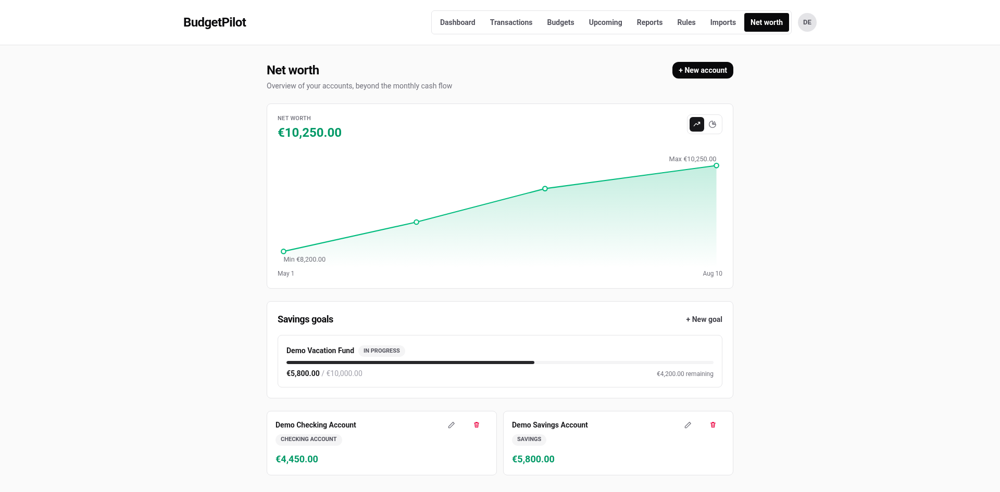
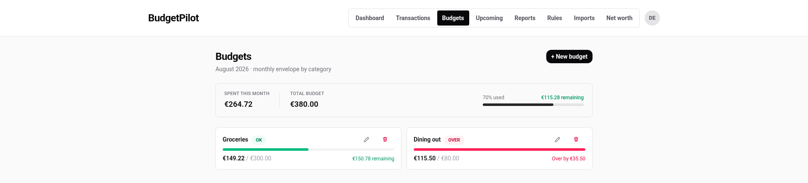

# BudgetPilot

[](https://github.com/NonoHM/budgetpilot/actions/workflows/ci.yml)
[](./LICENSE)
[](https://securityscorecards.dev/viewer/?uri=github.com/NonoHM/budgetpilot)
[](https://www.bestpractices.dev/projects/14059)

<sub>The Scorecard score measures supply-chain and repository posture, not application security, and a few checks are structurally out of reach for a single maintainer: Code-Review and Contributors need a second person, Branch-Protection is capped at tier 1 because tier 2 requires a mandatory reviewer, and Maintained rises on its own as the repository ages. [Full results](https://securityscorecards.dev/viewer/?uri=github.com/NonoHM/budgetpilot).</sub>

A local-first, privacy-first personal budgeting app. Think Monarch or YNAB, but self-hosted, and your bank data never leaves your own machine.


<p align="center">
  
  
</p>

All screenshots use fake demo data, not a real user's finances.

## What it does

- **Manual and CSV import**, with bank-specific profiles and duplicate detection.
- **Optional automatic bank sync** (PSD2, via Enable Banking). Off by default. HTTPS only, explicit host allowlist, no credential scraping, ever.
- **Budgets**: monthly, per category, with alerts when you're close to the limit.
- **[Net worth tracking](docs/using/net-worth.md)** across multiple accounts, with history over time.
- **[Savings goals](docs/using/savings-goals.md)**, with pace tracking and an optional link to a real account.
- **[Cash flow forecasting](docs/using/cash-flow-forecast.md)**: a deterministic projection of your upcoming balance, based on recurring income and expenses it actually detects from your history. No machine learning involved, nothing sent anywhere.
- **[Categorization rules](docs/using/rules.md)** (text or regex), applied automatically on import, never overriding something you fixed by hand. 157 ship with the app.
- **[Split transactions](docs/using/split-transactions.md)**: one payment across several categories, so an 80 € supermarket trip can be 50 € Groceries and 30 € Shopping. Budgets and reports count the parts, your totals stay exactly the same, and the CSV export carries the split back out and in again.
- **Tags**: free labels that cut across categories, so "Portugal 2026" can hold a train, a restaurant and a hotel while each keeps its own category. Filter the list by one, tag a whole filtered set at once, and undo that in a click.
- **Optional local AI advice** via Ollama. By default, only anonymized aggregates reach the model. An opt-in setting can add the labels of your largest expenses, never your full transaction history.
- **Backup and restore**: a full export of your own data, nothing held hostage.
- French and English, out of the box.

## Known limitations

Better to read these now than find them later. Every one has an open issue, so
you can follow or fix any of them.

**Read this one first.** If your bank writes dates the American way (month
first) or uses a dot for decimals, your statement will import on the wrong
dates instead of being refused. `01/06` is a valid date either way round, and
nothing in the file says which was meant. It is the only limitation here that
you cannot spot on screen. [#433](https://github.com/NonoHM/budgetpilot/issues/433)

The rest are visible, and none of them costs you data:

- The budgets page shows what you spent **in the categories you have
  budgeted**, not everything you spent. The screen does not say so yet.
  [#434](https://github.com/NonoHM/budgetpilot/issues/434)
- Reports compare part of this month against **all** of last month, so early in
  a month the comparison looks better than it is.
  [#435](https://github.com/NonoHM/budgetpilot/issues/435)
- Net worth history cannot be edited or deleted, so a mistyped past balance
  stays on the curve. [#436](https://github.com/NonoHM/budgetpilot/issues/436)
- Rules cannot be reordered. 157 ship switched on, so two of them will often
  match the same transaction and nothing tells you which one won.
  [#437](https://github.com/NonoHM/budgetpilot/issues/437)
- The first account created is the admin, and there is no way to make anyone
  else one. [#438](https://github.com/NonoHM/budgetpilot/issues/438)
- Account email addresses have to be plain ASCII on every database engine. See
  [configuration](docs/configuration.md#database).
- Bank sync needs HTTPS before it works at all, and it is two settings rather
  than one. Enable Banking's Control Panel refuses an `http://` redirect URL
  outright, with "uses unsupported scheme", so a plain-http instance cannot
  even finish registering an application. You need a TLS reverse proxy in
  front of BudgetPilot. Then `ORIGIN` and `BANK_SYNC_REDIRECT_ALLOWED_ORIGINS`
  both have to change to that same `https://` address. If `ORIGIN` still says
  `http://localhost:3000` while you browse over HTTPS, the **Connect** button
  answers 403 "Cross-site POST form submissions are forbidden" and the flow
  never starts. The failure is before the bank, not after it: you never leave
  BudgetPilot, and the redirect URL you registered is never reached, so the
  403 looks like a login or session problem rather than a bank sync one.
  `BANK_SYNC_REDIRECT_ALLOWED_ORIGINS` fails in the same place for the same
  reason, though it at least names itself on screen. Set all of it up before
  you register anything.
  See [bank sync](docs/bank-sync.md#https-is-required-before-any-of-this-works).

## Quick start

You need Docker with the Compose plugin (`docker compose version` should print v2 or newer). Nothing else: no clone, no build, no Node.js.

```bash
mkdir budgetpilot && cd budgetpilot
curl -O https://raw.githubusercontent.com/NonoHM/budgetpilot/main/docker-compose.prebuilt.yml
```

Create your `.env`. This block generates three secrets and looks up the current release for you. Paste it whole:

```bash
BUDGETPILOT_VERSION=$(curl -fsSL https://api.github.com/repos/NonoHM/budgetpilot/releases/latest \
  | grep -o '"tag_name": *"[^"]*"' | cut -d'"' -f4 | sed 's/.*v//')

cat > .env <<EOF
BOOTSTRAP_TOKEN=$(openssl rand -base64 32)
RATE_LIMIT_HASH_SECRET=$(openssl rand -hex 32)
TOTP_ENCRYPTION_KEY=$(openssl rand -hex 32)
BUDGETPILOT_VERSION=${BUDGETPILOT_VERSION:?Could not reach the Releases API. Take the number from https://github.com/NonoHM/budgetpilot/releases/latest and run BUDGETPILOT_VERSION=x.y.z, then paste this block again.}
APP_PORT=3000
EOF
```

`BUDGETPILOT_VERSION` decides which image you run. Pin it and you know what you are on, and the app shows the same number in **Settings**. Leave it out and Docker quietly reuses whatever it downloaded last time, which is how people end up running a version they never chose.

If the lookup cannot reach GitHub, no `.env` is written and the message tells you what to do instead. It will not fall back to an unpinned image behind your back. To upgrade later, run the same block again. See [running it day to day](docs/operations.md).

You will not find an `ORIGIN` line, on purpose. The compose file works it out from `APP_PORT`, so changing the port here is all you need. Set `ORIGIN` yourself only for a LAN address, a hostname, or a reverse proxy. See [configuration](docs/configuration.md).

Pull the image, then start it:

```bash
docker compose -f docker-compose.prebuilt.yml pull
docker compose -f docker-compose.prebuilt.yml up -d
```

`up -d` starts what you already have; it does not fetch a new version. The `pull` is what makes the version above the one you actually run.

Open **http://localhost:3000** and create your account. Registration is closed by default, so the form asks for a token: it's the `BOOTSTRAP_TOKEN` you just generated (`grep BOOTSTRAP_TOKEN .env`). The first account created becomes the admin. The interface starts in French, switch to English from Settings.

On Windows, run all of this from Git Bash or WSL. **Port 3000 already taken?** Change `APP_PORT` in `.env` to a free port, then `docker compose -f docker-compose.prebuilt.yml up -d` again, and open the new port. Nothing else to change. Want to run it from a source checkout instead? The [full walkthrough](docs/getting-started.md) covers that, plus running it without Docker.

Reaching it from another device on your LAN takes two extra lines in `.env` (`ORIGIN` and `PUBLIC_INSTANCE=false`), and a real domain with automatic HTTPS takes an optional [Caddy overlay](docs/reverse-proxy.md).

## Documentation

- **[Getting started](docs/getting-started.md)**: the detailed version of the above, three install paths, and what to do once you're in.
- **[Using BudgetPilot](docs/using/README.md)**: the app itself. [The dashboard](docs/using/dashboard.md), [budgets](docs/using/budgets.md), [reports](docs/using/reports.md), [rules](docs/using/rules.md), [categories](docs/using/categories.md), [upcoming bills](docs/using/upcoming-bills.md), [imports](docs/using/imports.md), [net worth](docs/using/net-worth.md), [transactions](docs/using/transactions.md), [tags](docs/using/tags.md), and [splitting one payment across several categories](docs/using/split-transactions.md).
- **[Your account](docs/using/account.md)**: the settings screen, plus [two-factor authentication](docs/using/two-factor.md), [exporting and restoring your data](docs/using/backup-restore.md), and [the admin panel](docs/using/admin.md) if you run the instance for other people.
- **[Configuration](docs/configuration.md)**: every setting, and how to reach the app from your phone or another machine.
- **[Reverse proxy](docs/reverse-proxy.md)**: optional Caddy overlay for a real domain with automatic HTTPS.
- **[PostgreSQL or MySQL](docs/database-providers.md)**: optional overlays for installs that already run a database server. SQLite is the default and needs nothing.
- **[Running it day to day](docs/operations.md)**: updating, backups, moving machines.
- **[Local AI advice](docs/ai-insights.md)** and **[bank sync](docs/bank-sync.md)**: the two optional features.
- **[Troubleshooting](docs/troubleshooting.md)**: when something's broken.

## Why this exists

Honest answer: my personal finances were kind of a mess, and I wanted an excuse to test agentic AI coding on something real, not just a toy script. Something with an actual UI, actual users (well, me), and enough moving parts to be a genuine test of whether "vibe coding" with an AI assistant could produce something solid, not just something that looks fine in a demo.

I'm not a professional developer. I built this over several months with Claude, trying to hold myself to real standards anyway: proper security reviews, a real test suite, a design system that's actually consistent instead of every page inventing its own button style. Whether I pulled that off is for you to judge by reading the code, not by trusting this README.

This isn't trying to replace Monarch, YNAB, or the other well-established players in this space. Open source alternatives exist too (Firefly III, Actual Budget, to name two), and they're more mature and, in some areas, better built than this. BudgetPilot is just my take on it, local-first and privacy-first by default, and I'm putting it out there in case it's useful to someone else too.

CSV import is still where most of the remaining work is. Four bank profiles are recognised automatically and any other bank is imported by telling the app what its columns mean, but the format coverage below is real and contributions there are especially welcome.

## Tech stack

SvelteKit, TypeScript, Prisma, SQLite by default (PostgreSQL and MySQL/MariaDB optional), Tailwind CSS, Vitest, Playwright, Docker.

## Contributing

Bug reports, feature ideas, and pull requests are all welcome. See [CONTRIBUTING.md](./CONTRIBUTING.md) for setup, tests, and commit conventions. If you're using an AI coding assistant, there's an [AGENTS.md](./AGENTS.md) with project context it should read first.

Release notes live in [CHANGELOG.md](./CHANGELOG.md).

## Security

This is a finance app, so security gets taken seriously. See [SECURITY.md](./SECURITY.md) for what's supported and how to report a vulnerability privately (please don't open a public issue for that one).

For what has actually been verified, by whom, and what is not covered, see [how this project's security is verified](./docs/explanation/security-verification.md). No independent third party has audited this project, and that page says so first.

## License

[Apache License 2.0](./LICENSE).
