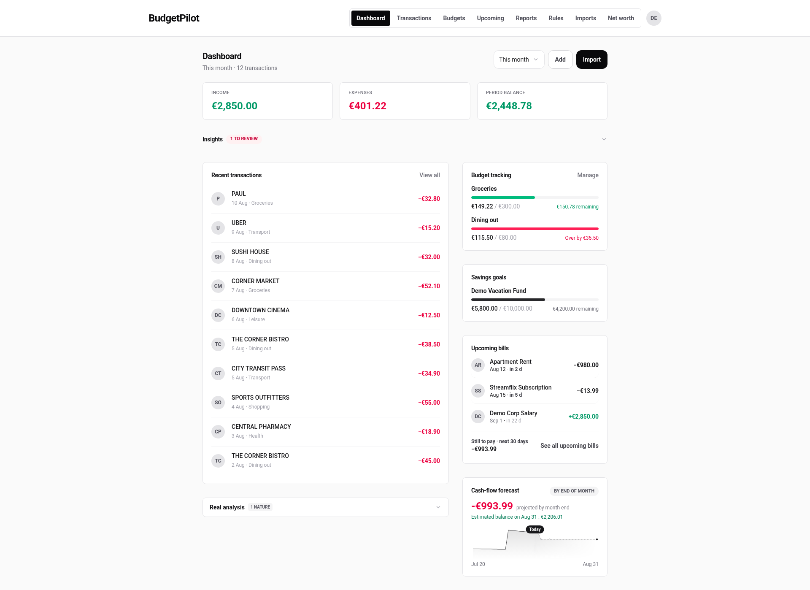
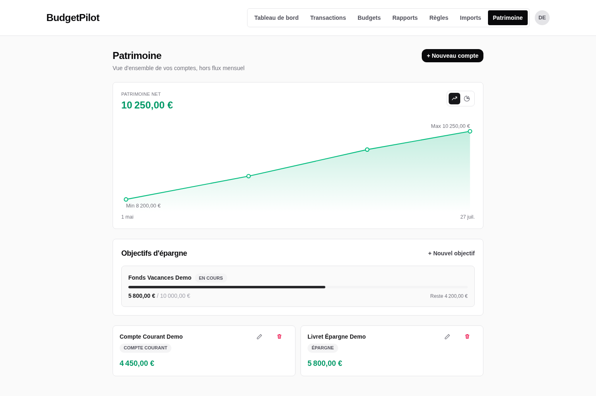
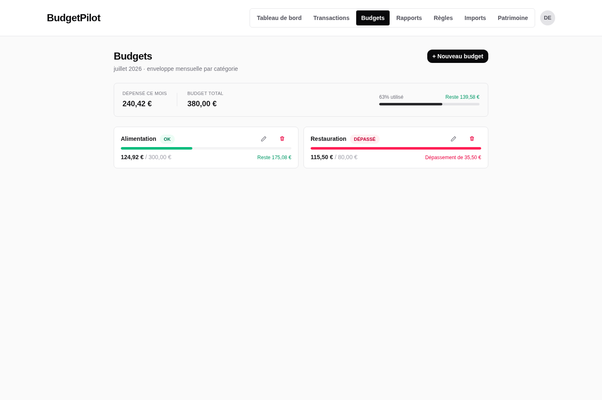

# BudgetPilot

[](https://github.com/NonoHM/budgetpilot/actions/workflows/ci.yml)
[](./LICENSE)

A local-first, privacy-first personal budgeting app. Think Monarch or YNAB, but self-hosted, and your bank data never leaves your own machine.

## Why this exists

Honest answer: my personal finances were kind of a mess, and I wanted an excuse to test agentic AI coding on something real, not just a toy script. Something with an actual UI, actual users (well, me), and enough moving parts to be a genuine test of whether "vibe coding" with an AI assistant could produce something solid, not just something that looks fine in a demo.

I'm not a professional developer. I built this over several months with Claude, trying to hold myself to real standards anyway: proper security reviews, a real test suite, a design system that's actually consistent instead of every page inventing its own button style. Whether I pulled that off is for you to judge by reading the code, not by trusting this README.

This isn't trying to replace Monarch, YNAB, or the other well-established players in this space. There are open source alternatives out there (Firefly III, Actual Budget, to name two) that are more mature and, in some areas, better built than this. BudgetPilot is just my take on it, local-first and privacy-first by default, and I'm putting it out there in case it's useful to someone else too.

The weakest part right now is honestly CSV import: only a handful of bank profiles are supported, and the parser system needs more work to cover more banks and formats. Contributions there especially welcome.

**Known limitations:**

- SQLite only for now — Postgres/MariaDB aren't supported.
- CSV import covers a limited set of bank profiles; unlisted banks need a new parser.



<p align="center">
  
  
</p>

All screenshots use fake demo data, not a real user's finances.

## What it does

- **Manual and CSV import**, with bank-specific profiles and duplicate detection.
- **Optional automatic bank sync** (PSD2, via Enable Banking). Off by default. HTTPS only, explicit host allowlist, no credential scraping, ever.
- **Budgets**: monthly, per category, with alerts when you're close to the limit.
- **Net worth tracking** across multiple accounts, with history over time.
- **Savings goals**, with pace tracking and an optional link to a real account.
- **Cash flow forecasting**: a deterministic projection of your upcoming balance, based on recurring income and expenses it actually detects from your history. No machine learning involved, nothing sent anywhere.
- **Categorization rules** (text or regex), applied automatically on import, never overriding something you fixed by hand.
- **Optional local AI advice** via Ollama. By default, only anonymized aggregates reach the model. An opt-in setting can add the labels of your largest expenses, never your full transaction history.
- **Backup and restore**: a full export of your own data, nothing held hostage.
- French and English, out of the box.

## Tech stack

SvelteKit, TypeScript, Prisma, SQLite, Tailwind CSS, Vitest, Playwright, Docker.

## Quick start (no Docker)

```bash
nvm install && nvm use
npm install
cp .env.example .env
```

Then generate three secrets and paste them into `.env`. Skipping this step will crash `/register` and `/login` on first load, so don't skip it:

```bash
openssl rand -base64 32   # -> BOOTSTRAP_TOKEN
openssl rand -hex 32      # -> RATE_LIMIT_HASH_SECRET
openssl rand -hex 32      # -> TOTP_ENCRYPTION_KEY
```

```bash
npx prisma generate && npx prisma migrate dev
npm run dev
```

Open `http://localhost:5173`. The first account you register needs the `BOOTSTRAP_TOKEN` you just generated, and it becomes an admin automatically.

## Docker

**Prerequisite:** Docker Engine 24+ with the Compose plugin (`docker compose version` should print `v2.x` or newer). Don't have it yet? [Install Docker](https://docs.docker.com/get-started/get-docker/), then come back here.

### Without a GPU or AI (default)

```bash
cp .env.example .env
```

Generate three secrets and paste them into `.env`. Skipping this crashes `/register` and `/login` on first load, so don't skip it:

```bash
openssl rand -base64 32   # -> BOOTSTRAP_TOKEN
openssl rand -hex 32      # -> RATE_LIMIT_HASH_SECRET
openssl rand -hex 32      # -> TOTP_ENCRYPTION_KEY
```

A generated value ending in `=`, or containing `+` or `/`, is normal `openssl` output — paste it exactly as printed, it isn't a copy mistake.

```bash
docker compose up -d --build
```

`-d` runs the app in the background ("detached"); `--build` builds the image (needed the first time, and again after any code change).

Once the command returns, open **http://localhost:3000**. The first account you register needs the `BOOTSTRAP_TOKEN` you just generated, and it becomes an admin automatically. The interface defaults to French — switch to English any time from Settings.

Just the app, backed by a persistent SQLite volume. No Ollama container, no GPU needed.

**If something doesn't work:** `docker compose logs -f budgetpilot` streams the app's logs (`-f` follows them live, Ctrl+C to stop watching). The most common cause of a broken `/register` or `/login` is a blank secret in `.env` — it shows up there as a clear `"<VAR_NAME> is required"` line.

**If port 3000 is already used** by something else on your machine, change **both** of these to match each other (changing only one causes every form submission — login, register, ... — to fail with a `403 Cross-site POST form submissions are forbidden` error):

- the `ports:` line in `docker-compose.yml`, e.g. `'3001:3000'`
- `ORIGIN=http://localhost:3001` in `.env` (must match the port you actually open in the browser)

### With local AI (Ollama)

You'll need an NVIDIA GPU with [nvidia-container-toolkit](https://docs.nvidia.com/datacenter/cloud-native/container-toolkit/latest/install-guide.html) installed. No GPU? Drop the `deploy.resources` block from `docker-compose.ai.yml` and Ollama will just run on CPU. Slower, but it works.

```bash
cp .env.example .env
# same three secrets as above (openssl rand -base64 32 / -hex 32 / -hex 32)
docker compose -f docker-compose.yml -f docker-compose.ai.yml up -d --build
docker compose exec ollama ollama pull qwen2.5:0.5b
```

The two `-f` flags just tell Compose to merge both files — the base app plus the optional Ollama service — into one stack.

Set `LLM_ENABLED=true` in `.env`, then enable AI insights per user in Settings.

To stop either setup: `docker compose down`. Add `-v` only if you actually want to wipe your data — it also deletes the named volumes (your SQLite database, and any downloaded Ollama models).

## Troubleshooting

- **Port 3000 already in use?** Remap it — see [If port 3000 is already used](#without-a-gpu-or-ai-default) above. You must update `ORIGIN` in `.env` to match, or every form submission will fail.
- **App crash-loops, logs show a missing-secret error?** Run `docker compose logs budgetpilot` and check all three secrets (`BOOTSTRAP_TOKEN`, `RATE_LIMIT_HASH_SECRET`, `TOTP_ENCRYPTION_KEY`) are set in `.env`.
- **UI shows up in French?** That's the default locale, not a bug — switch to English from Settings.

Found something else? Please [open a GitHub issue](https://github.com/NonoHM/budgetpilot/issues) rather than expecting it documented here — this section covers known gotchas, not a running bug list.

## Contributing

Bug reports, feature ideas, and pull requests are all welcome. See [CONTRIBUTING.md](./CONTRIBUTING.md) for setup, tests, and commit conventions. If you're using an AI coding assistant, there's an [AGENTS.md](./AGENTS.md) with project context it should read first.

Release notes live in [CHANGELOG.md](./CHANGELOG.md).

## Security

This is a finance app, so security gets taken seriously. See [SECURITY.md](./SECURITY.md) for what's supported and how to report a vulnerability privately (please don't open a public issue for that one).

## License

[Apache License 2.0](./LICENSE).
