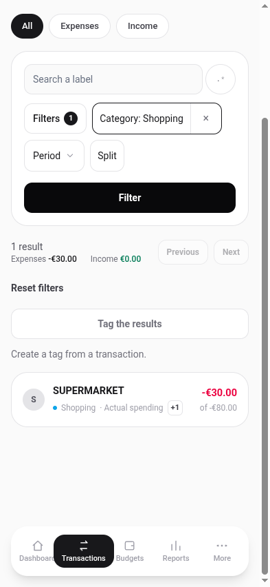

# Why a split row shows two amounts under a filter

The same transaction shows a different amount depending on the URL. That looks
like a bug and is not. This page is why, so the next person to notice does not
undo it.

## The behaviour

An 80.00 € supermarket trip, split 50.00 € Groceries and 30.00 € Shopping.

With no filter, the row shows **-80.00 €**: the amount the bank took.

Filter by Shopping and the same row shows **-30.00 €**, with **of -80.00 €**
beneath it in smaller type, and the category cell reads Shopping rather than
Groceries.

## The reason

A category filter is a question about **money**, not about transactions. "Show
me Shopping" means "show me what I spent on Shopping", and the answer for that
transaction is 30.00 €, not 80.00 €.

The alternative is worse, and it was the behaviour before. Showing the whole
80.00 € puts a number on the row that is not the number the filter matched, and
the summary above the list still counts 30.00 € because the summary counts what
the filter actually found. One row saying 80.00 € under a total saying 30.00 €
is a 50.00 € discrepancy on screen with nothing explaining it. A reader checking
their own arithmetic concludes the filter is broken and stops trusting it,
which is the opposite of what a filter is for.

So the row states the matched part, and the parent amount travels with it on
the second line so that "but the transaction was 80.00 €, wasn't it?" is
answered before it is asked. The two figures are different because they answer
different questions, and both are labelled.

The consequence worth stating plainly: **under a category filter, adding up the
Amount column reproduces the summary total, exactly.** That property is the
point of the design. It is what tells you the screen is not lying to you.

It also has to hold without a mouse. The badge has a tooltip on a computer, and
a phone has no hover, so the disclosure cannot live there. Both figures are
rendered as text on the row, at both sizes.

## What other tools do

Two comparisons, both taken from published documentation rather than from
running the products.

**Actual Budget documents the opposite outcome as a known caveat.** Their
filtering page states, under Caveats: "Split transactions do not behave well in
the filtered view. The non-applicable part of the filtered results can end up
getting added into the total." That is the failure this design exists to avoid,
described by the people who ship it.

**Firefly III answers the question at a different layer.** Their documentation
describes a split as one "transaction group" containing one "transaction
journal" per split, so the split is several records rather than one record with
parts. A filter then has separate rows to return and never has to decide what a
single row's amount means. That is a coherent alternative, and it costs
something we did not want to pay: the transaction stops being one thing, so
"this is one 80.00 € payment" is no longer expressible in the data.

We keep one transaction with parts, which is why the row has to make a choice
about which amount to show, which is why it shows both.

Sources: [Actual Budget, Filtering
Transactions](https://actualbudget.org/docs/transactions/filters/);
[Firefly III, Transactions](https://docs.firefly-iii.org/explanation/financial-concepts/transactions/).

We did not verify how either product renders a filtered list, only what their
documentation says, so nothing above is a claim about their screens.

## Where this shows up

- The transactions list, described in the
  [split reference](../reference/split-transactions.md#what-the-row-shows-under-a-category-filter).
- The CSV export, which follows the same rule: exporting under a category
  filter writes the matched parts, not whole splits.
- Not the dashboard or reports, which have no category filter of this kind.
