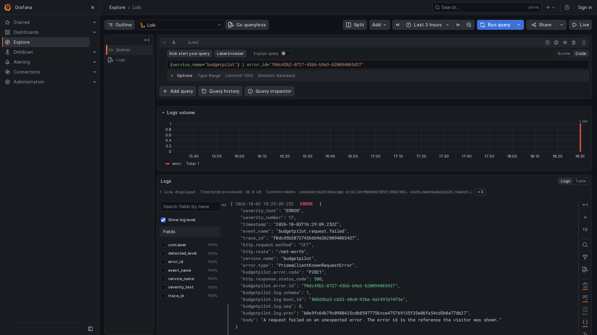

# Send the log to a collector

**Audience:** whoever runs the instance, and whoever feeds its log into a log platform or a SIEM
(a security monitoring system). **Type:** how-to, with one reference table.

A collector reads the container's log and forwards it to a place that keeps it, searches it and
alerts on it. This page gives four recipes, each tested against a real log from a real run, and a
table that maps BudgetPilot's fields to OpenTelemetry, ECS and OCSF names. Read
[Logs](./logging.md) first for what a line contains and what it never contains.

BudgetPilot itself sends nothing. It writes lines to standard output and has no transport, no
OpenTelemetry SDK and no vendor format. Everything on this page runs in the collector, which you
install, configure and secure.

Every recipe was run on 2026-10-03, against a real log written by the application. In the tests the
containers and the Docker network carried a test prefix and the application ran on another port.
The commands below use short names (`budgetpilot`, `otel-gateway`, `logging-net`) and the standard
ports, and nothing else differs from what was run.

## What the collector receives

Docker keeps each line of the container's output in a file, wrapped as
`{"log":"...","stream":"stdout","time":"..."}`. The three things below are true of every recipe, so
check each against your own data.

- **Not every line is BudgetPilot's.** At each start, the database tool that updates the database
  prints plain text before the first JSON line, and some of its lines go to the error stream. A
  recipe has to keep them, or say that it drops them. Each recipe below keeps them as plain text.
- **Some lines are empty.** The database tool prints blank lines. One recipe (Loki) never stores
  an empty line, and says so.
- **Numbers can change type.** `http.response.status_code` is `404` in the line. The OpenTelemetry
  Collector reads every JSON number as a floating-point value and prints it as `Double(404)`. Check
  how your platform stores such a field before you build an alert on it.

### Two ways to read the container's output

The recipes use whichever is simplest for that collector. They are not equal for security.

| Method                                         | What the collector needs                                                       | What that grants                                                                                                     |
| ---------------------------------------------- | ------------------------------------------------------------------------------ | -------------------------------------------------------------------------------------------------------------------- |
| Read Docker's log file                         | A read-only mount of one container's folder under `/var/lib/docker/containers` | Read access to that container's log, which holds Operational and Pseudonymous data only.                             |
| Read through the Docker socket (`docker.sock`) | A mount of `/var/run/docker.sock`                                              | Control of the Docker daemon, which is control of the host. A read-only mount does not limit what the socket allows. |

Prefer the file when the collector supports it. Mount only the folder of the BudgetPilot container,
never `/var/lib/docker/containers` as a whole, which holds the logs of every container on the host.
Both recipes that read the file need to run as root (`--user 0:0`), because Docker's files belong to
root.

The folder is named after the container's identifier, which changes when Compose recreates the
container (see [Read, filter and check the log](./logging-howto.md#read-the-log)). Restart a
collector that reads the file after you recreate the container.

Get the identifier:

```bash
docker inspect --format '{{.Id}}' budgetpilot
```

## Results

Each collector was started against a log with a known number of lines, and the records it delivered
were counted. The counts below were read from the collector's own output, and the source count is
the number of lines of `docker logs`.

| Collector                       | Image and version                              | Read through  | Source lines | Records received | What it dropped                                                              |
| ------------------------------- | ---------------------------------------------- | ------------- | ------------ | ---------------- | ---------------------------------------------------------------------------- |
| OpenTelemetry Collector contrib | `otel/opentelemetry-collector-contrib:0.161.0` | File          | 35           | 35               | Nothing. Plain lines arrive as records without a severity.                   |
| Vector                          | `timberio/vector:0.58.0-alpine`                | Docker socket | 16           | 16               | Nothing. Plain lines are marked `is_json: false`.                            |
| Fluent Bit                      | `fluent/fluent-bit:5.1.3`                      | File          | 67           | 67               | Nothing. Plain lines keep their text in `log`.                               |
| Grafana Alloy and Loki          | `grafana/alloy:v1.20.1`, `grafana/loki:3.7.8`  | Docker socket | 101          | 81               | The 20 empty lines, which Loki never stores. All 81 lines with text arrived. |

Wazuh, Elastic and Splunk have no tested recipe here. They get the [field mapping](#field-mapping)
only.

## OpenTelemetry Collector

The recipe has two collectors. An agent reads Docker's log file and sends the records over OTLP, the
OpenTelemetry protocol, to a gateway. The test gateway prints what it receives. In your setup, the
gateway is your own platform, or you replace the `otlp_grpc` exporter with the one your platform
documents.

1. Create `otel-agent.yaml`.

   ```yaml
   receivers:
     file_log:
       include:
         - /var/lib/docker/containers/*/*-json.log
       start_at: beginning
       operators:
         # Docker's json-file wrapper: {"log":"...","stream":"stdout","time":"..."}.
         # Puts the original line in the body and the stream in log.iostream.
         - type: container
           add_metadata_from_filepath: false
         # Only lines that start with "{" are BudgetPilot JSON. The others
         # (prisma migrate deploy's text) pass through unparsed, as plain text.
         - type: json_parser
           if: 'body matches "^\\{"'
           parse_from: body
           parse_to: attributes
           timestamp:
             parse_from: attributes.timestamp
             layout_type: strptime
             layout: '%Y-%m-%dT%H:%M:%S.%LZ'
           severity:
             parse_from: attributes.severity_text
         - type: trace_parser
           if: 'attributes.trace_id != nil'
           trace_id:
             parse_from: attributes.trace_id
         - type: move
           if: 'attributes.body != nil'
           from: attributes.body
           to: body
         - type: move
           if: 'attributes["service.name"] != nil'
           from: attributes["service.name"]
           to: resource["service.name"]
         - type: remove
           if: 'attributes.timestamp != nil'
           field: attributes.timestamp
         - type: remove
           if: 'attributes.severity_text != nil'
           field: attributes.severity_text
         - type: remove
           if: 'attributes.severity_number != nil'
           field: attributes.severity_number
         - type: remove
           if: 'attributes.trace_id != nil'
           field: attributes.trace_id

   exporters:
     otlp_grpc:
       endpoint: otel-gateway:4317
       tls:
         insecure: true # test network only; see "Security notes"

   service:
     pipelines:
       logs:
         receivers: [file_log]
         exporters: [otlp_grpc]
   ```

   The `container` operator reads Docker's wrapper. The `json_parser` reads BudgetPilot's line. The
   `move` and `remove` operators put each field where the OpenTelemetry data model expects it:
   the app's `timestamp` becomes the record's time, its `severity_text` sets the severity,
   `trace_id` becomes the trace id, `body` becomes the body and `service.name` moves to the resource.
   Everything else stays an attribute. The `event_name` stays an attribute as well, named
   `event_name`.

1. Create `otel-gateway.yaml`.

   ```yaml
   receivers:
     otlp:
       protocols:
         grpc:
           endpoint: 0.0.0.0:4317

   exporters:
     debug:
       verbosity: detailed

   service:
     pipelines:
       logs:
         receivers: [otlp]
         exporters: [debug]
   ```

1. Create a network and start the gateway, then the agent.

   ```bash
   docker network create logging-net
   docker run -d --name otel-gateway --network logging-net \
     -v "$PWD/otel-gateway.yaml:/etc/otelcol-contrib/config.yaml:ro" \
     otel/opentelemetry-collector-contrib:0.161.0
   ID=$(docker inspect --format '{{.Id}}' budgetpilot)
   docker run -d --name otel-agent --network logging-net --user 0:0 \
     -v "$PWD/otel-agent.yaml:/etc/otelcol-contrib/config.yaml:ro" \
     -v "/var/lib/docker/containers/$ID:/var/lib/docker/containers/$ID:ro" \
     otel/opentelemetry-collector-contrib:0.161.0
   ```

1. Count the records the gateway received.

   ```bash
   docker logs otel-gateway 2>&1 | grep -c "LogRecord #"
   ```

   In the test, against a log of 35 lines, it printed `35`.

1. Read a record. The gateway printed this one for the first line of the database tool, which is not
   JSON:

   ```text
   LogRecord #0
   ObservedTimestamp: 2026-10-03 16:23:12.502188923 +0000 UTC
   Timestamp: 2026-10-03 16:16:56.680170923 +0000 UTC
   SeverityText:
   SeverityNumber: Unspecified(0)
   Body: Str(Loaded Prisma config from prisma.config.ts.
   )
   Attributes:
        -> log.file.name: Str(449fb749b93c0754c58dee25be091190d0178f66aceb6cef7ad5323f409bda6b-json.log)
        -> log.iostream: Str(stderr)
   Trace ID:
   Span ID:
   Flags: 0
   ```

   The next one is the startup line (the attributes print in a different order on each run):

   ```text
   Resource attributes:
        -> service.name: Str(budgetpilot)
   LogRecord #0
   ObservedTimestamp: 2026-10-03 16:23:12.502226043 +0000 UTC
   Timestamp: 2026-10-03 16:16:57.005 +0000 UTC
   SeverityText: WARN
   SeverityNumber: Warn(13)
   Body: Str(BudgetPilot started. The attributes are the security-relevant configuration it started with.)
   Attributes:
        -> event_name: Str(sys_startup)
        -> budgetpilot.config.database_provider: Str(sqlite)
        -> budgetpilot.config.security_log: Str(on)
        -> budgetpilot.config.trusted_proxy_ranges: Double(0)
        -> budgetpilot.config.origin_set: Bool(true)
        -> budgetpilot.config.public_instance: Str(secure)
        -> log.iostream: Str(stdout)
        -> service.version: Str(1.2.0)
        -> budgetpilot.log.boot_id: Str(74d02b15-2b29-4cf0-b2eb-ed574a2acec2)
        -> budgetpilot.config.log_level: Str(info)
        -> log.file.name: Str(449fb749b93c0754c58dee25be091190d0178f66aceb6cef7ad5323f409bda6b-json.log)
        -> budgetpilot.config.cookies_secure: Bool(true)
        -> budgetpilot.log.seq: Double(1)
        -> budgetpilot.log.prev: Str(0000000000000000000000000000000000000000000000000000000000000000)
        -> budgetpilot.log.schema: Double(1)
   Trace ID:
   Span ID:
   Flags: 0
   ```

   And the error line, with its trace id in the record's own field:

   ```text
   LogRecord #24
   ObservedTimestamp: 2026-10-03 16:23:12.502234973 +0000 UTC
   Timestamp: 2026-10-03 16:17:00.793 +0000 UTC
   SeverityText: ERROR
   SeverityNumber: Error(17)
   Body: Str(A request failed on an unexpected error. The error id is the reference the visitor was shown.)
   Attributes:
        -> budgetpilot.log.boot_id: Str(74d02b15-2b29-4cf0-b2eb-ed574a2acec2)
        -> budgetpilot.log.schema: Double(1)
        -> log.file.name: Str(449fb749b93c0754c58dee25be091190d0178f66aceb6cef7ad5323f409bda6b-json.log)
        -> http.response.status_code: Double(500)
        -> budgetpilot.log.seq: Double(25)
        -> budgetpilot.log.prev: Str(a5666171d9e6b7241ecaee96c2218e3192529df73ede06e36f4d71e6b9ddb31f)
        -> http.request.method: Str(GET)
        -> budgetpilot.error.id: Str(143a9bc5-ba4b-496a-8f0c-b47ea2b44b8c)
        -> http.route: Str(/net-worth)
        -> error.type: Str(PrismaClientKnownRequestError)
        -> log.iostream: Str(stdout)
        -> event_name: Str(budgetpilot.request.failed)
        -> budgetpilot.error.code: Str(P2021)
   Trace ID: 143a9bc5ba4b496a8f0cb47ea2b44b8c
   Span ID:
   Flags: 0
   ```

What to know about the result:

- The record's time is BudgetPilot's own `timestamp`, not the time the agent read the line
  (`ObservedTimestamp`).
- Numbers arrive as `Double`, as in `budgetpilot.log.seq: Double(1)` above, including counters that
  are whole numbers in the line.
- `log.file.name` carries the container identifier. Remove it with a `remove` operator if you do not
  want it to travel.
- The deprecated names `filelog` and `otlp` still work in this version, with a warning. The recipe
  uses the current ones, `file_log` and `otlp_grpc`, for the exporter. The receiver in the gateway
  is still called `otlp`.

## Vector

Vector reads through the Docker socket, parses the JSON, and sends the lines that are not JSON to a
second output. The test prints to standard output, one JSON object per record.

1. Create `vector.yaml`.

   ```yaml
   sources:
     budgetpilot:
       type: docker_logs
       docker_host: unix:///var/run/docker.sock
       # A name or an id; matched as a prefix. Only this container is read.
       include_containers:
         - budgetpilot

   transforms:
     parse:
       type: remap
       inputs: [budgetpilot]
       source: |
         # The source adds the Compose labels, which carry the absolute path of the
         # Compose file on the host. Drop what you do not need to keep.
         del(.label)
         del(.host)
         del(.image)
         del(.container_created_at)
         .is_json = false
         parsed, err = parse_json(.message)
         if err == null && is_object(parsed) {
           .is_json = true
           . = merge(., object!(parsed))
           .message = .body
           del(.body)
           .timestamp = parse_timestamp!(.timestamp, "%+")
         }

     split:
       type: route
       inputs: [parse]
       route:
         json: .is_json == true

   sinks:
     # Lines BudgetPilot wrote: one JSON object per event.
     structured:
       type: console
       inputs: [split.json]
       encoding:
         codec: json
     # Everything else, kept as it arrived (prisma migrate deploy's text).
     plain:
       type: console
       inputs: [split._unmatched]
       encoding:
         codec: json
   ```

   The `del` lines matter. The Docker source attaches the container's Compose labels, which in the
   test held the absolute path of the Compose file on the host. Delete them unless you need them,
   because they leave the machine with every record.

1. Start Vector.

   ```bash
   docker run -d --name vector --network logging-net --user 0:0 \
     -v "$PWD/vector.yaml:/etc/vector/vector.yaml:ro" \
     -v /var/run/docker.sock:/var/run/docker.sock \
     timberio/vector:0.58.0-alpine
   ```

   In the test, the Docker source delivered nothing that the container had written before Vector
   started, only what it wrote afterwards. To see records, restart the application and ask for a
   page that does not exist.

   ```bash
   docker compose restart budgetpilot
   curl -s -o /dev/null http://localhost:3000/missing-page
   ```

1. Count the records. Vector writes them to its standard output, which is its Docker log.

   ```bash
   docker logs vector 2>/dev/null | wc -l
   ```

   In the test, the restart and the request wrote 16 lines
   (`docker logs --since <time of the restart> budgetpilot 2>&1 | wc -l`), and Vector printed 16
   records, 7 of them JSON and 9 plain.

1. Read a plain record and a BudgetPilot record from the test:

   ```text
   {"container_id":"449fb749b93c0754c58dee25be091190d0178f66aceb6cef7ad5323f409bda6b","container_name":"bp13-docs-app","is_json":false,"message":"Loaded Prisma config from prisma.config.ts.","source_type":"docker_logs","stream":"stderr","timestamp":"2026-10-03T16:25:33.015356153Z"}
   {"budgetpilot.error.id":"d4005058-d7f4-4a21-81a4-99fc25ab4be4","budgetpilot.log.boot_id":"339fc291-69eb-47f2-b14e-d29b567257f0","budgetpilot.log.prev":"41cf2405be9a534e1356420701855a67002b9f5102f3b79fe205bc2001ff3d37","budgetpilot.log.schema":1,"budgetpilot.log.seq":5,"container_id":"449fb749b93c0754c58dee25be091190d0178f66aceb6cef7ad5323f409bda6b","container_name":"bp13-docs-app","event_name":"budgetpilot.request.not_found","http.request.method":"GET","http.response.status_code":404,"is_json":true,"message":"A request matched no page.","service.name":"budgetpilot","severity_number":9,"severity_text":"INFO","source_type":"docker_logs","stream":"stdout","timestamp":"2026-10-03T16:25:34.496Z","trace_id":"d4005058d7f44a2181a499fc25ab4be4"}
   ```

   The test container was named `bp13-docs-app`, so that is the `container_name` printed. Yours is
   `budgetpilot`.

To send the records to a platform instead, replace the two `console` sinks with the sink your
platform documents, for example `loki` or `elasticsearch`. Those sinks were not run for this page.

## Fluent Bit

Fluent Bit tails Docker's log file and parses the JSON. A line that is not JSON fails the parser
and passes through unchanged, so it is kept.

1. Create `fluent-bit.yaml`.

   ```yaml
   service:
     parsers_file: /fluent-bit/etc/budgetpilot-parsers.yaml

   pipeline:
     inputs:
       - name: tail
         path: /var/lib/docker/containers/*/*-json.log
         parser: docker
         read_from_head: true
         tag: budgetpilot

     filters:
       # Parse the app's JSON out of the Docker wrapper's "log" field. A line that
       # is not JSON (prisma migrate deploy's text) fails the parser and passes
       # through unchanged, with its text still in "log".
       - name: parser
         match: budgetpilot
         key_name: log
         parser: budgetpilot_json
         reserve_data: true

     outputs:
       - name: stdout
         match: '*'
         format: json_lines
   ```

1. Create `budgetpilot-parsers.yaml`.

   ```yaml
   parsers:
     # Docker's json-file wrapper around every line.
     - name: docker
       format: json
       time_key: time
       time_format: '%Y-%m-%dT%H:%M:%S.%L'
       time_keep: on

     # One BudgetPilot line. The record time becomes the app's own timestamp.
     - name: budgetpilot_json
       format: json
       time_key: timestamp
       time_format: '%Y-%m-%dT%H:%M:%S.%L%z'
       time_keep: on
   ```

1. Start Fluent Bit.

   ```bash
   ID=$(docker inspect --format '{{.Id}}' budgetpilot)
   docker run -d --name fluent-bit --network logging-net --user 0:0 \
     -v "$PWD/fluent-bit.yaml:/fluent-bit/etc/fluent-bit.yaml:ro" \
     -v "$PWD/budgetpilot-parsers.yaml:/fluent-bit/etc/budgetpilot-parsers.yaml:ro" \
     -v "/var/lib/docker/containers/$ID:/var/lib/docker/containers/$ID:ro" \
     fluent/fluent-bit:5.1.3 /fluent-bit/bin/fluent-bit -c /fluent-bit/etc/fluent-bit.yaml
   ```

1. Count the records, which Fluent Bit writes to its standard output.

   ```bash
   docker logs fluent-bit 2>/dev/null | wc -l
   ```

   In the test, against a log of 67 lines, it printed `67`. Counting by field showed 40 parsed lines
   and 27 plain lines.

1. Read a plain record and a BudgetPilot record from the test:

   ```text
   {"date":1791044216.680171,"log":"Loaded Prisma config from prisma.config.ts.\n","stream":"stderr","time":"2026-10-03T16:16:56.680170923Z"}
   {"date":1791044220.078,"severity_text":"INFO","severity_number":9,"timestamp":"2026-10-03T16:17:00.078Z","event_name":"budgetpilot.request.not_found","trace_id":"c9365d238f4342ea8c750522b5f1ba9b","http.request.method":"GET","service.name":"budgetpilot","http.response.status_code":404,"budgetpilot.error.id":"c9365d23-8f43-42ea-8c75-0522b5f1ba9b","budgetpilot.log.schema":1,"budgetpilot.log.boot_id":"74d02b15-2b29-4cf0-b2eb-ed574a2acec2","budgetpilot.log.seq":5,"budgetpilot.log.prev":"f87db391abda9d7745f5eecdd595d494ab53417a9cab4f03e39a604b231c09a2","body":"A request matched no page.","stream":"stdout","time":"2026-10-03T16:17:00.078760646Z"}
   ```

   `date` is the record's time, in seconds since 1970, taken from the app's own `timestamp`.

To send the records to a platform, replace the `stdout` output with the one your platform
documents. Those outputs were not run for this page.

## Grafana Alloy and Loki

Alloy finds the container through the Docker socket, reads its JSON, and pushes the lines to Loki.
Grafana, optional, searches Loki. The recipe stores the event name and the severity as labels, which
index a stream, and the request identifiers as structured metadata, which Loki searches without
creating a stream for each value.

1. Create `config.alloy`.

   ```text
   // Find the BudgetPilot container through the Docker socket.
   discovery.docker "budgetpilot" {
     host = "unix:///var/run/docker.sock"

     filter {
       name   = "name"
       values = ["budgetpilot"]
     }
   }

   discovery.relabel "budgetpilot" {
     targets = discovery.docker.budgetpilot.targets

     rule {
       source_labels = ["__meta_docker_container_name"]
       regex         = "/(.*)"
       target_label  = "container"
     }

     rule {
       target_label = "service_name"
       replacement  = "budgetpilot"
     }
   }

   loki.source.docker "budgetpilot" {
     host       = "unix:///var/run/docker.sock"
     targets    = discovery.relabel.budgetpilot.output
     forward_to = [loki.process.budgetpilot.receiver]
   }

   loki.process "budgetpilot" {
     // Reads the JSON of each line. A line that is not JSON (prisma migrate
     // deploy's text) extracts nothing and goes on to Loki unchanged.
     stage.json {
       expressions = {
         severity_text  = "severity_text",
         event_name     = "event_name",
         trace_id       = "trace_id",
         error_id       = "\"budgetpilot.error.id\"",
       }
     }

     // Labels index a stream, so only values from a small closed set go here:
     // there are a few dozen event names and five severities.
     stage.labels {
       values = {
         severity_text = "",
         event_name    = "",
       }
     }

     // Values that are different on every line go in structured metadata, which
     // is searchable without creating a stream per value.
     stage.structured_metadata {
       values = {
         trace_id = "",
         error_id = "",
       }
     }

     forward_to = [loki.write.local.receiver]
   }

   loki.write "local" {
     endpoint {
       url = "http://loki:3100/loki/api/v1/push"
     }
   }
   ```

   The `filter` matches container names as a pattern, so use the exact name of your container.

   Do not add a `stage.timestamp` that sets the time from the line's own `timestamp`. It was tried
   and removed: the lines that are not JSON then took the time of the last JSON line before them,
   plus a few nanoseconds, instead of the time they were written. Without it, every record keeps the
   time Docker recorded, which is within milliseconds of the app's.

1. Start Loki with its default configuration, then Alloy.

   ```bash
   docker run -d --name loki --network logging-net -p 127.0.0.1:3100:3100 grafana/loki:3.7.8
   docker run -d --name alloy --network logging-net --user 0:0 \
     -v "$PWD/config.alloy:/etc/alloy/config.alloy:ro" \
     -v /var/run/docker.sock:/var/run/docker.sock \
     grafana/alloy:v1.20.1 run --storage.path=/var/lib/alloy/data /etc/alloy/config.alloy
   ```

   Loki needs about twenty seconds after it starts before it accepts lines. The default
   configuration keeps the data inside the container, which is enough to test. Plan storage and
   retention before you rely on it.

1. Count what Loki holds for the container, and compare with the log. Alloy reads the container's
   whole log the first time it sees it.

   ```bash
   docker logs budgetpilot 2>&1 | wc -l
   docker logs budgetpilot 2>&1 | grep -c .
   curl -s -G http://localhost:3100/loki/api/v1/query_range \
     --data-urlencode 'query={container="budgetpilot"}' \
     --data-urlencode 'limit=5000' --data-urlencode 'direction=forward' \
     --data-urlencode "start=$(date -u -d '1 hour ago' +%s)000000000" \
     | jq '[.data.result[].values | length] | add'
   ```

   The first command counts every line, and the second counts the lines that hold something. In the
   test they printed `101` and `81`, and Loki returned `81`. The other 20 lines were empty, and Loki
   does not store an empty line. The `date -d` option is the GNU one: on macOS, replace it with a
   timestamp in nanoseconds.

1. Find an error by its reference. This is the point of the labels and the metadata above. In
   Grafana, or any client of the Loki API, run either query with the reference from the error page:

   ```text
   {service_name="budgetpilot"} | error_id="f0dc45b2-0727-43bb-b9e3-620094065437"
   ```

   ```text
   {service_name="budgetpilot"} |= "f0dc45b2-0727-43bb-b9e3-620094065437"
   ```

   The first filters on the structured metadata. The second searches the text of every line. Both
   returned exactly one entry in the test, the line of the error:

   ```text
   {"severity_text":"ERROR","severity_number":17,"timestamp":"2026-10-03T16:29:09.252Z","event_name":"budgetpilot.request.failed","trace_id":"f0dc45b2072743bbb9e3620094065437","http.request.method":"GET","http.route":"/net-worth","service.name":"budgetpilot","error.type":"PrismaClientKnownRequestError","budgetpilot.error.code":"P2021","http.response.status_code":500,"budgetpilot.error.id":"f0dc45b2-0727-43bb-b9e3-620094065437","budgetpilot.log.schema":1,"budgetpilot.log.boot_id":"808d3ba3-c633-48c0-92be-4a2491b74f3e","budgetpilot.log.seq":8,"budgetpilot.log.prev":"b0a9fc64b79c0988425cdb85977756cce475769135f35e86fa54cd5b0e77db27","body":"A request failed on an unexpected error. The error id is the reference the visitor was shown."}
   ```

1. Optional: look at it in Grafana. Create `grafana-datasource.yaml`:

   ```yaml
   apiVersion: 1
   datasources:
     - name: Loki
       uid: loki
       type: loki
       access: proxy
       url: http://loki:3100
       isDefault: true
   ```

   Start Grafana on a local port, with anonymous access for this test only:

   ```bash
   docker run -d --name grafana --network logging-net -p 127.0.0.1:3001:3000 \
     -e GF_AUTH_ANONYMOUS_ENABLED=true -e GF_AUTH_ANONYMOUS_ORG_ROLE=Admin -e GF_AUTH_DISABLE_LOGIN_FORM=true \
     -v "$PWD/grafana-datasource.yaml:/etc/grafana/provisioning/datasources/loki.yaml:ro" \
     grafana/grafana:13.2.3
   ```

   Open `http://localhost:3001/explore`, choose **Loki**, switch to the **Code** view, paste the
   first query, and select **Run query**.

   

   Anonymous administrator access, as above, is for a test on your own computer. Do not publish
   that port or use that setting anywhere else.

## Field mapping

How each field maps to the names other tools use. Use it to configure a collector that converts the
format. BudgetPilot's field names follow OpenTelemetry already, so the OpenTelemetry column mostly
says where a field goes in the record: the envelope fields become the record's own fields, and the
rest stay attributes.

This is a recommended mapping, not an official crosswalk: no standard publishes one between these
names. Each name was checked against its source, each read on 2026-10-03:

- OpenTelemetry log data model, Stable:
  [opentelemetry.io/docs/specs/otel/logs/data-model](https://opentelemetry.io/docs/specs/otel/logs/data-model/).
  The field names of the log record are `Timestamp`, `ObservedTimestamp`, `TraceId`, `SpanId`,
  `TraceFlags`, `SeverityText`, `SeverityNumber`, `Body`, `Resource`, `InstrumentationScope`,
  `Attributes` and `EventName`.
- OpenTelemetry semantic conventions, Stable:
  [`http.request.method`, `http.response.status_code` and `http.route`](https://opentelemetry.io/docs/specs/semconv/registry/attributes/http/),
  [`service.name` and `service.version`](https://opentelemetry.io/docs/specs/semconv/registry/attributes/service/),
  [`error.type`](https://opentelemetry.io/docs/specs/semconv/registry/attributes/error/).
  `log.iostream`, `log.file.name` and `log.file.path`, which the Docker readers add, are
  [Development](https://opentelemetry.io/docs/specs/semconv/registry/attributes/log/), not Stable.
- ECS (the Elastic Common Schema, which Elastic and Wazuh use): each name below was found in the
  field list [`generated/csv/fields.csv`](https://raw.githubusercontent.com/elastic/ecs/main/generated/csv/fields.csv)
  of the ECS repository, main branch, version 9.6.0-dev, by looking up every name in the `Field`
  column. `http.route` is not in it.
- OCSF 1.5.0:
  [Base Event](https://schema.ocsf.io/1.5.0/classes/base_event),
  [HTTP Activity](https://schema.ocsf.io/1.5.0/classes/http_activity),
  [Metadata](https://schema.ocsf.io/1.5.0/objects/metadata),
  [Product](https://schema.ocsf.io/1.5.0/objects/product),
  [HTTP Request](https://schema.ocsf.io/1.5.0/objects/http_request) and
  [HTTP Response](https://schema.ocsf.io/1.5.0/objects/http_response).

| BudgetPilot field           | OpenTelemetry log record                                            | ECS                                       | OCSF 1.5.0                                       |
| --------------------------- | ------------------------------------------------------------------- | ----------------------------------------- | ------------------------------------------------ |
| `timestamp`                 | `Timestamp`                                                         | `@timestamp`                              | `time`                                           |
| `severity_text`             | `SeverityText`                                                      | `log.level`                               | `severity` (and `severity_id`, below)            |
| `severity_number`           | `SeverityNumber` (same scale)                                       | no field: ECS has no number on this scale | `severity_id`: its own scale, 0 to 6 and 99      |
| `event_name`                | `EventName`. Kept as the attribute `event_name` in the recipe above | `event.action`                            | `metadata.event_code`                            |
| `body`                      | `Body`                                                              | `message`                                 | `message`                                        |
| `trace_id`                  | `TraceId`                                                           | `trace.id`                                | `metadata.correlation_uid`                       |
| `budgetpilot.error.id`      | attribute                                                           | `error.id`                                | `http_request.uid` (HTTP Activity class)         |
| `http.request.method`       | attribute `http.request.method`                                     | `http.request.method`                     | `http_request.http_method` (HTTP Activity class) |
| `http.response.status_code` | attribute `http.response.status_code`                               | `http.response.status_code`               | `http_response.code` (HTTP Activity class)       |
| `http.route`                | attribute `http.route`                                              | no field: put it under `labels`           | no field: keep it in `unmapped`                  |
| `service.name`              | resource attribute `service.name`                                   | `service.name`                            | `metadata.product.name`                          |
| `service.version`           | resource attribute `service.version`                                | `service.version`                         | `metadata.product.version`                       |
| `error.type`                | attribute `error.type`                                              | `error.type`                              | no field: keep it in `unmapped`                  |
| `budgetpilot.error.code`    | attribute                                                           | `error.code`                              | no field: keep it in `unmapped`                  |
| `budgetpilot.log.seq`       | attribute                                                           | `event.sequence`                          | `metadata.sequence`                              |
| `budgetpilot.log.boot_id`   | attribute                                                           | no field: put it under `labels`           | no field: keep it in `unmapped`                  |
| `budgetpilot.log.prev`      | attribute                                                           | no field: put it under `labels`           | no field: keep it in `unmapped`                  |
| `budgetpilot.log.schema`    | attribute                                                           | no field: put it under `labels`           | `metadata.log_version`                           |
| the whole line, as written  | (not mapped: the record is the line, parsed)                        | `event.original`                          | `raw_data`                                       |

Notes on the table:

- **Severity.** OpenTelemetry's scale is the one BudgetPilot writes. OCSF's `severity_id` is a
  different scale: `1` Informational, `2` Low, `3` Medium, `4` High, `5` Critical, `6` Fatal, `0`
  Unknown, `99` Other. The choice of which BudgetPilot severity becomes which `severity_id` is
  yours. A common choice is `INFO` and `DEBUG` to `1`, `WARN` to `3`, `ERROR` to `4` and `FATAL` to
  `6`.
- **OCSF classes.** Two events describe an HTTP request: `budgetpilot.request.not_found` and
  `budgetpilot.request.failed`. They fit the HTTP Activity class, whose `http_request` and
  `http_response` objects hold the fields above. No other event does. Use the Base Event class for
  them, where the `http_*` fields do not exist.
- **Fields with no ECS or OCSF name** stay as custom fields. ECS has `labels` for key-value pairs.
  OCSF has `unmapped`. Keep the names unchanged so that a query written against BudgetPilot's own
  names still works.
- **Wazuh, Elastic and Splunk.** The mapping above is the only support this page gives them. No
  recipe for them was run, and no claim is made about how they ingest the log.

## Security notes

- **What the collector holds.** Operational and Pseudonymous data only: no secret, no financial
  figure and no personal data
  ([Logs, « What a field may contain »](./logging.md#what-a-field-may-contain)). No client
  address appears in this version, and when one does, only as a keyed hash. The collector is still
  a copy of the log. Give it the access control you would give the log itself.
- **How long to keep it.** Set retention on the collector. The CNIL recommends six months to a
  year for logs of this kind, and a year is the ceiling to set. The source and the wording are in
  [Logs, « How long logs are kept »](./logging.md#how-long-logs-are-kept).
- **The connection to the collector.** Use TLS and authentication on the OTLP endpoint, the Loki
  endpoint or whichever endpoint you send to. The recipes above use no TLS, on a Docker network
  that only your containers share, for the test. That is not a configuration to copy to a network
  you do not control.
- **Why the copy matters.** The hash chain proves that a copy of the log was not edited. It cannot
  stop someone who controls the host from rewriting the file and the chain together. A copy held
  on another machine, where that person has no access, is what makes the chain mean something. Run
  [the check](./logging-howto.md#check-that-no-line-was-removed-or-edited) against the copy, not
  against the host's file.
- **The application sends nothing.** BudgetPilot never contacts the collector. The collector reads,
  or is sent, what the container wrote. The only network connection in these recipes is the one the
  collector opens.

## Clean up

To remove everything the recipes created, remove the containers and the network by name:

```bash
docker rm -f otel-agent otel-gateway vector fluent-bit alloy loki grafana
docker network rm logging-net
```

The images stay on disk until you remove them with `docker rmi`.
