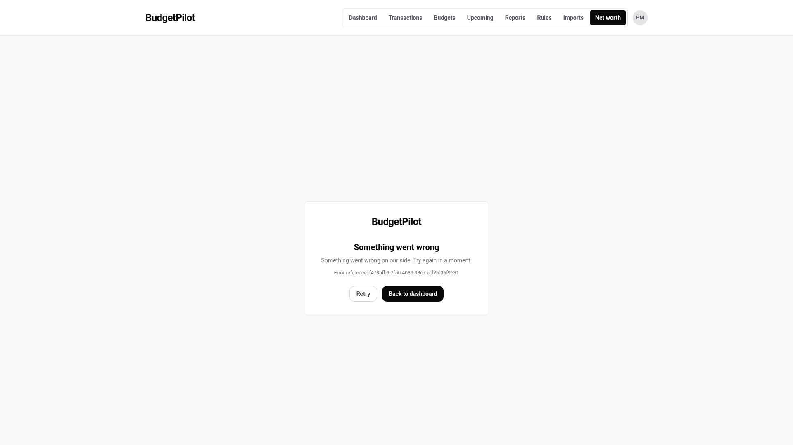

# Your first look at the logs

**Audience:** whoever runs the instance, with no need to be a developer. **Type:** tutorial.

In about fifteen minutes you read the lines BudgetPilot writes about itself, using the instance you
already installed. You read the line it writes when it starts, cause a "page not found" and find its
line, then make a page fail on purpose and use the reference the error page shows to find what went
wrong. Step 5 renames one database table for a few seconds and step 6 renames it back. No row of
your data is read or changed.

Every command and every output below comes from a real run of the application, on an instance with
one synthetic account (Paul Mercier, `paul.mercier@example.test`) and no transactions. Your values
differ: identifiers and times are not the same twice, and the fingerprints that chain the lines
change with them. The shape of each line is the same.

## Before you start

You need:

- A BudgetPilot instance installed with [Getting started](./getting-started.md), option A, with an
  account you can sign in to. Use an instance you just installed. Step 5 breaks one screen for a few
  seconds, so do not do it on an instance other people are using.
- `jq`, a program that reads JSON. Check that it is there:

  ```bash
  jq --version
  ```

  If it prints a version, you are set. If the command is not found, install `jq` with your
  system's package manager and run the check again.

- A terminal in the folder that holds your `docker-compose.prebuilt.yml`. Tell Docker Compose which
  file to use, so that every command below can be short:

  ```bash
  export COMPOSE_FILE=docker-compose.prebuilt.yml
  ```

  The setting lasts until you close the terminal.

The commands show the instance at `http://localhost:3000`, the address Getting started gives. If you
changed `APP_PORT`, use your port.

## 1. Look at what the server wrote

1. Show the first three lines of the log.

   ```bash
   docker compose logs --no-log-prefix budgetpilot | head -n 3
   ```

   You see:

   ```text
   Loaded Prisma config from prisma.config.ts.

   Prisma schema loaded from prisma/schema.prisma.
   ```

   These lines are not BudgetPilot's. They come from the database tool that BudgetPilot runs each
   time it starts, to bring the database up to date. They are plain text, not JSON, and they come
   first.

1. Show the last four lines.

   ```bash
   docker compose logs --no-log-prefix --tail 4 budgetpilot | cut -c1-110
   ```

   You see:

   ```text
   {"severity_text":"WARN","severity_number":13,"timestamp":"2026-10-04T12:08:38.249Z","event_name":"sys_startup"
   {"severity_text":"WARN","severity_number":13,"timestamp":"2026-10-04T12:08:38.250Z","event_name":"budgetpilot.
   {"severity_text":"WARN","severity_number":13,"timestamp":"2026-10-04T12:08:38.250Z","event_name":"budgetpilot.
   {"severity_text":"WARN","severity_number":13,"timestamp":"2026-10-04T12:08:38.330Z","event_name":"budgetpilot.
   ```

   The `cut` command keeps the first 110 characters of each line, because the full lines are long.
   Each line is one JSON object, and each object is one event: something that happened. BudgetPilot
   writes nothing else of its own. A line holds only values from a fixed list, numbers, identifiers
   the server generated and text the application wrote. It never holds anything a visitor typed.

## 2. Read the startup line

The first event of every start is called `sys_startup`. It states the settings the server started
with.

1. Print that one event, indented so a person can read it.

   ```bash
   docker compose logs --no-log-prefix budgetpilot | jq -R 'fromjson? | select(.event_name == "sys_startup")'
   ```

   `jq -R` reads each line as text. `fromjson?` turns a line into JSON and quietly skips the lines
   that are not JSON, such as the database tool's. `select` keeps the lines whose `event_name` is
   `sys_startup`.

   You see:

   ```text
   {
     "severity_text": "WARN",
     "severity_number": 13,
     "timestamp": "2026-10-03T17:03:35.859Z",
     "event_name": "sys_startup",
     "service.name": "budgetpilot",
     "service.version": "1.2.0",
     "budgetpilot.config.public_instance": "secure",
     "budgetpilot.config.cookies_secure": true,
     "budgetpilot.config.database_provider": "sqlite",
     "budgetpilot.config.trusted_proxy_ranges": 0,
     "budgetpilot.config.origin_set": true,
     "budgetpilot.config.security_log": "on",
     "budgetpilot.config.log_level": "info",
     "budgetpilot.log.schema": 1,
     "budgetpilot.log.boot_id": "201187db-785a-4363-b514-a1607c30afd2",
     "budgetpilot.log.seq": 1,
     "budgetpilot.log.prev": "0000000000000000000000000000000000000000000000000000000000000000",
     "body": "BudgetPilot started. The attributes are the security-relevant configuration it started with."
   }
   ```

1. Read it field by field.

   | Field                                     | What it tells you                                                                                                            |
   | ----------------------------------------- | ---------------------------------------------------------------------------------------------------------------------------- |
   | `severity_text`, `severity_number`        | How important the line is. `WARN` is 13. The startup line is always `WARN` or higher, so no setting can hide it.             |
   | `timestamp`                               | When the line was written, in UTC (the `Z` at the end).                                                                      |
   | `event_name`                              | What happened. The [event list](./logging.md#every-event) names every one.                                                   |
   | `service.name`, `service.version`         | Which program, and which version of it, wrote the line.                                                                      |
   | `budgetpilot.config.public_instance`      | `secure` when the instance expects HTTPS (`PUBLIC_INSTANCE=true`), `lan` when it runs over plain http on a trusted network.  |
   | `budgetpilot.config.cookies_secure`       | Whether sign-in cookies are marked to travel only over HTTPS.                                                                |
   | `budgetpilot.config.database_provider`    | The database in use: `sqlite`, `postgresql` or `mysql`.                                                                      |
   | `budgetpilot.config.trusted_proxy_ranges` | How many reverse-proxy address ranges you declared in `TRUSTED_PROXIES`. `0` means none.                                     |
   | `budgetpilot.config.origin_set`           | Whether `ORIGIN`, the address people type in the browser, is set.                                                            |
   | `budgetpilot.config.security_log`         | `on` or `off`, from `BP_SECURITY_LOG`.                                                                                       |
   | `budgetpilot.config.log_level`            | The lowest severity written, from `BP_LOG_LEVEL`.                                                                            |
   | `budgetpilot.log.schema`                  | The version of these field names. It is `1`.                                                                                 |
   | `budgetpilot.log.boot_id`                 | A random identifier for this start of the server. A restart gives a new one.                                                 |
   | `budgetpilot.log.seq`                     | The line's number within this start: `1` for the first, then one more for each line.                                         |
   | `budgetpilot.log.prev`                    | A fingerprint (a SHA-256 hash) of the line before this one. On the first line there is nothing before it, so it is 64 zeros. |
   | `body`                                    | One fixed English sentence for the event.                                                                                    |

   The fields `boot_id`, `seq` and `prev` chain the lines together. You use them in
   [Check that no line was removed or edited](./logging-howto.md#check-that-no-line-was-removed-or-edited).

## 3. Cause a "page not found" and find its line

1. Ask for a page that does not exist.

   ```bash
   curl -s -o /dev/null -w '%{http_code}\n' http://localhost:3000/no-such-page
   ```

   You see:

   ```text
   404
   ```

1. Print the line that request wrote.

   ```bash
   docker compose logs --no-log-prefix budgetpilot | jq -R 'fromjson? | select(.event_name == "budgetpilot.request.not_found")'
   ```

   You see:

   ```text
   {
     "severity_text": "INFO",
     "severity_number": 9,
     "timestamp": "2026-10-03T17:03:38.144Z",
     "event_name": "budgetpilot.request.not_found",
     "trace_id": "36cd7ea91af74817bde6238bc1f87d0d",
     "http.request.method": "GET",
     "service.name": "budgetpilot",
     "http.response.status_code": 404,
     "budgetpilot.error.id": "36cd7ea9-1af7-4817-bde6-238bc1f87d0d",
     "budgetpilot.log.schema": 1,
     "budgetpilot.log.boot_id": "201187db-785a-4363-b514-a1607c30afd2",
     "budgetpilot.log.seq": 5,
     "budgetpilot.log.prev": "5d07b01672a6f07b4016d6544711b87061d92b7b847c803baf7c984558887c8f",
     "body": "A request matched no page."
   }
   ```

   Compare it with the startup line. Four things stand out:

   - `trace_id` is an identifier the server made up for this one request. It is the same on every
     line this request writes. A header sent by the browser or a proxy never sets it.
   - `http.request.method` is the kind of request, `GET` here.
   - There is no `http.route` and no address. The line says that a page was not found, not which
     page you asked for, because what a visitor types in the address bar is the one thing the log
     never records.
   - `budgetpilot.error.id` is the same identifier as `trace_id`, written with dashes. Step 4 uses
     that.

   The `seq` is 5 because the server wrote four lines when it started (step 1) and this is the fifth.

## 4. Find a line from a reference

A reference is what you get when someone tells you "I saw error such-and-such". It is the line's
`budgetpilot.error.id`.

1. Keep the identifier from step 3 in a variable. Replace the value with the one in your own output.

   ```bash
   REF=36cd7ea9-1af7-4817-bde6-238bc1f87d0d
   ```

1. Search the log for it.

   ```bash
   docker compose logs --no-log-prefix budgetpilot | jq -cR --arg ref "$REF" 'fromjson? | select(.["budgetpilot.error.id"] == $ref) | [.timestamp, .event_name, .trace_id]'
   ```

   You see:

   ```text
   ["2026-10-03T17:03:38.144Z","budgetpilot.request.not_found","36cd7ea91af74817bde6238bc1f87d0d"]
   ```

   The square brackets are the three values `jq` was asked to print: the time, the event and the
   `trace_id`. Because the `trace_id` is the reference without its dashes, you can also search by
   it:

   ```bash
   docker compose logs --no-log-prefix budgetpilot | jq -cR --arg ref "$REF" 'fromjson? | select(.trace_id == ($ref | gsub("-"; ""))) | [.timestamp, .event_name, .trace_id]'
   ```

   You see the same line:

   ```text
   ["2026-10-03T17:03:38.144Z","budgetpilot.request.not_found","36cd7ea91af74817bde6238bc1f87d0d"]
   ```

   Most requests write one line, so the two searches find one. The `trace_id` matters once you send
   the log to a collector that holds lines from several systems: it is the value to search for
   there.

## 5. Make a page fail and find its reference

A real failure shows the visitor an error page with a reference. You make one fail on purpose, then
use the reference.

1. Sign in to your instance in the browser, at `http://localhost:3000`.
1. Rename one database table, so that the Net worth page cannot read it. The command runs inside the
   BudgetPilot container, which includes a small SQLite tool in Node.

   ```bash
   docker compose exec budgetpilot /nodejs/bin/node -e 'new (require("node:sqlite").DatabaseSync)("/data/budgetpilot.db").exec(`ALTER TABLE "NetWorthAccount" RENAME TO "NetWorthAccount_paused"`)'
   ```

   The command prints nothing when it works.

   This step needs SQLite, the default database. On PostgreSQL or MySQL, read the next steps without
   running them.

1. In the browser, open **Net worth** from the menu. The page fails and shows an error page with a
   reference:

   

1. Copy the identifier after **Error reference** and keep it in a variable. Replace the value with
   the one on your own page: the reference in the picture above, and the one in the commands below,
   are from different runs, and yours will differ from both.

   ```bash
   REF=64fc7273-48ec-46ab-8a70-eb639d379ce0
   ```

1. Print the line with that reference.

   ```bash
   docker compose logs --no-log-prefix budgetpilot | jq -R --arg ref "$REF" 'fromjson? | select(.["budgetpilot.error.id"] == $ref)'
   ```

   You see:

   ```text
   {
     "severity_text": "ERROR",
     "severity_number": 17,
     "timestamp": "2026-10-03T17:03:40.526Z",
     "event_name": "budgetpilot.request.failed",
     "trace_id": "64fc727348ec46ab8a70eb639d379ce0",
     "http.request.method": "GET",
     "http.route": "/net-worth",
     "service.name": "budgetpilot",
     "error.type": "PrismaClientKnownRequestError",
     "budgetpilot.error.code": "P2021",
     "http.response.status_code": 500,
     "budgetpilot.error.id": "64fc7273-48ec-46ab-8a70-eb639d379ce0",
     "budgetpilot.log.schema": 1,
     "budgetpilot.log.boot_id": "201187db-785a-4363-b514-a1607c30afd2",
     "budgetpilot.log.seq": 6,
     "budgetpilot.log.prev": "6dfed0076931c0bd8fc94f874dd2256d434f45de91a3ed692ed92bcdee83f1f1",
     "body": "A request failed on an unexpected error. The error id is the reference the visitor was shown."
   }
   ```

   This is what the reference leads to:

   - `severity_text` is `ERROR`, the level at which something is wrong on the server's side.
   - `http.route` is `/net-worth`: the page, as a template (a page such as `/imports/[batchId]`
     stands for every import), never the exact address.
   - `http.response.status_code` is `500`, the code for "the server failed".
   - `error.type` and `budgetpilot.error.code` say what kind of failure. `P2021` is the database
     library's code for a table that does not exist, which is what you did.
   - There is no error message and no stack trace. The log never records them, because they can
     contain the data that was being handled when the failure happened.

## 6. Put the table back

1. Rename the table back.

   ```bash
   docker compose exec budgetpilot /nodejs/bin/node -e 'new (require("node:sqlite").DatabaseSync)("/data/budgetpilot.db").exec(`ALTER TABLE "NetWorthAccount_paused" RENAME TO "NetWorthAccount"`)'
   ```

1. Open **Net worth** again. The page loads.

Your data was never touched: you changed the name of a table and changed it back.

## What you did

You read the start of a log, found a line by what it says and by a reference, and followed a
reference from the error page to the line that explains it. To go further:

- [Read and filter the log, and check that it is intact](./logging-howto.md) covers the everyday
  tasks.
- [Send the log to a collector](./logging-collectors.md) is for keeping a copy off the host.
- [Why the log looks like this](./explanation/logging-design.md) explains the choices you saw: one
  object per line, no addresses, no messages.
- [Logs](./logging.md) lists every event and every field.

---

If you use an instance someone else runs, [what the security log records about you](./using/security-logging.md)
is the page written for you.
