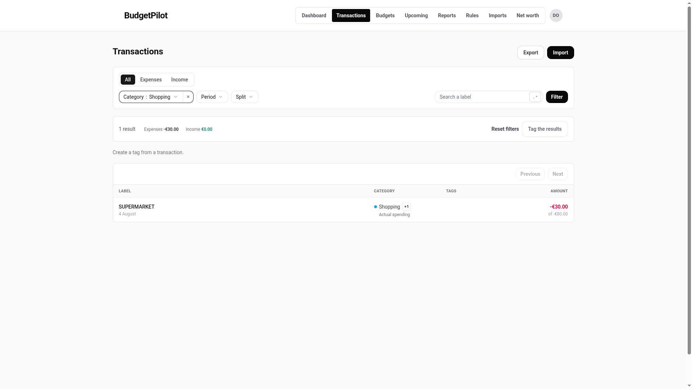

# Split transactions: rules and limits

Every figure here was read out of the code, not recalled. For the steps, see
[splitting a transaction](../using/split-transactions.md).

## Limits

| Rule                                                 | Value                |
| ---------------------------------------------------- | -------------------- |
| Fewest parts                                         | 2                    |
| Most parts                                           | 20                   |
| Largest amount for one part                          | 1,000,000.00 €       |
| Note length                                          | 80 characters        |
| Parts add up to the transaction                      | exactly, to the cent |
| A part can be the same category as another part      | yes                  |
| A part can be uncategorized                          | no                   |
| A part can point the opposite way to the transaction | no                   |

A one-part split is a category with extra steps, which is why the floor is
two. If you find yourself wanting one, you want to change the category
instead.

The per-part ceiling is enforced by the editor, not by the server. It is the
same bound the manual transaction form uses.

## The remainder

The line above **Save** always states where you are:

| It says              | It means                                                                   |
| -------------------- | -------------------------------------------------------------------------- |
| **Left to allocate** | The parts do not add up to the transaction yet. Save is unavailable.       |
| **Fully allocated**  | The parts add up exactly. Save is available.                               |
| **Over-allocated**   | The parts add up to more than the transaction. It says how much to remove. |

The parts adding up to the transaction is the whole rule of splitting. It is
not a preference: it is what keeps every other total in the app adding up.

## The rounding cent

**Split evenly** distributes the amount so the parts still sum exactly. When
the division is not clean, the **first** parts get the extra cent, and the
editor marks which part carries it.

10.00 € across three parts gives 3.34 €, then 3.33 €, then 3.33 €.

Which part carries the cent is stable. It follows the part's position, so it
does not move between one viewing and the next.

## What a split changes elsewhere

- **Budgets, reports and the dashboard count the parts**, not the transaction.
  Split 80.00 € into 50.00 € Groceries and 30.00 € Shopping and your Groceries
  budget sees 50.00 €, not 80.00 € and not nothing.
- **Your totals do not change.** The parts add up to the transaction, so every
  overall figure is exactly what it was before. Splitting moves money between
  categories, it never creates or destroys any.
- **The list shows the biggest part's category**, with a badge for the rest.
  `+2` means two other categories besides the one shown. `×3` means three
  parts that are all in the same category.
- **It leaves the "to classify" pile.** A split transaction is fully
  categorized by definition.
- **Categorization rules leave it alone.** A rule that would have moved it to
  another category skips it, both when the rule runs and in the preview count.
- **Nature is resolved per part.** If one part is in a category you mapped to
  Transfer and another to Spending, the transaction counts as both, for the
  amounts concerned.
- **Deleting a category it uses is refused.** See the message below.

## What the row shows under a category filter

Unfiltered, the row shows the transaction's own full amount.

Filter by a category and the row changes to answer the question you asked: it
shows the **matched part's** category and amount, with the transaction's full
amount beneath it as "of 80.00 €".

The summary at the top of the list counts the same matched part, so the rows
and the total always agree. Why it works this way is
[explained separately](../explanation/filtered-row-amounts.md).

## Splits in the CSV export

The export writes **one line per category the money went to**. A transaction
split three ways is three lines, so the per-category totals in your
spreadsheet match the ones in the app.

Three extra columns keep those lines readable and re-importable:

| Column             | What it holds                                                      |
| ------------------ | ------------------------------------------------------------------ |
| `montant_total`    | The transaction's full amount, repeated on every line of the group |
| `part`             | `1/3`, `2/3`, `3/3`. Which part this is, and how many there are    |
| `categorie_parent` | The category the transaction returns to if the split is removed    |

Importing that file back gives you one transaction with its parts again, not
three separate transactions. See
[importing and exporting](../getting-started.md#first-steps-in-the-app) for
the import side.

Two things the round trip does not do:

- **Part notes are not in the file.** Everything else survives: the
  categories, the amounts, their order, and the category the transaction falls
  back to.
- **Re-importing an export into the same instance adds nothing.** Every line
  is recognised as something you already have and reported as a duplicate.
  This is on purpose. To move data to another instance, export from this one
  and import into that one.

### Exporting with a category filter active

Download the CSV while a category filter is set and the file matches what the
screen showed you: only the parts that went to that category, not every part
of every split the filter pulled in. The `part` column still states the true
number of parts, so a split you only partly exported reads as incomplete, for
example `2/3` with no `1/3` or `3/3` beside it.

That is deliberate. A filtered export is a view of what you were looking at,
not a backup, so importing it back is refused with a clear reason rather than
silently recreating a smaller, wrong split. For a file that always imports
cleanly, export without a category filter.

## When something is refused

### Save is unavailable

The panel always says why, and it is one of these:

| The reason line says                              | Do this                                                  |
| ------------------------------------------------- | -------------------------------------------------------- |
| Save becomes available when the remainder is zero | Adjust an amount until **Fully allocated**               |
| The parts exceed {total}. Remove {amount}         | Lower a part by that amount, or remove a part            |
| Change the split to save                          | Nothing has changed since you opened it                  |
| Choose a category for every part                  | One part still has no category                           |
| Choose a category for part {n}                    | That part's category was deleted while you had this open |

### "Every part must carry a non-zero amount."

One message, five different causes. Check each part's amount field for:

| Cause                     | What it looks like                          |
| ------------------------- | ------------------------------------------- |
| Empty                     | the field was cleared and left blank        |
| Not a number              | letters, symbols, or more than two decimals |
| Zero                      | `0,00`, the value each part starts at       |
| Above 1,000,000.00 €      | more than the per-part ceiling              |
| Pointing the opposite way | a part that would be income on an expense   |

The message does not say which part or which cause, so when it appears, read
the amounts rather than guessing.

### "A split has at least 2 parts."

You tried to remove the second-to-last part. Use **Remove the split** instead,
which is the explicit way back to a single category.

### "20 parts is the maximum."

Twenty is well past any real receipt. If you genuinely need more, the
transaction is probably several transactions.

### "The parts must add up to exactly the transaction amount."

You will normally see the remainder line long before this. It appears if the
transaction's amount changed underneath you, for example because another
window edited it while this panel was open. Reopen the transaction and the
parts are as you left them.

### "This category carries N split parts."

You tried to delete a category that parts still point at, on the
**Categories** page. Deleting it would leave that money nowhere, so the app
refuses and offers a link to the transactions concerned. Change those parts to
another category first, or remove those splits, then delete.

Renaming a category is different and always allowed. Parts follow the rename,
because a renamed category is still the same category.

### "The split could not be saved. Your parts are kept."

Something went wrong on the server. Nothing was written, and the parts you
typed are still on screen, so **Try again** is safe. Two longer versions of
this message name the cause: an expired session, or a server that did not
answer. If it keeps happening, see
[troubleshooting](../troubleshooting.md).
