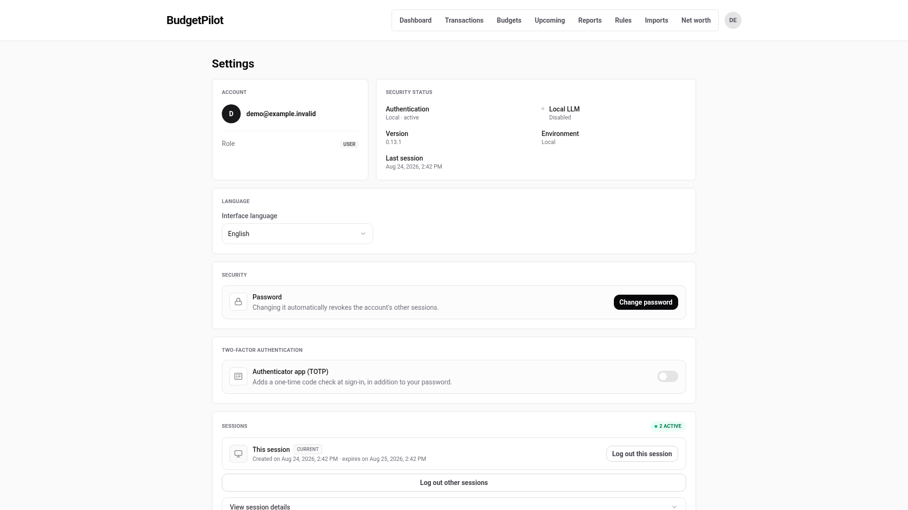
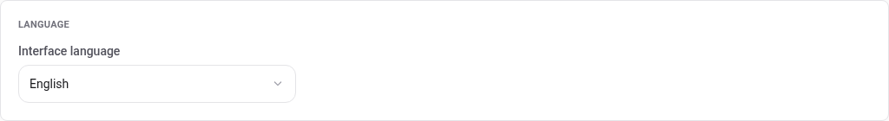
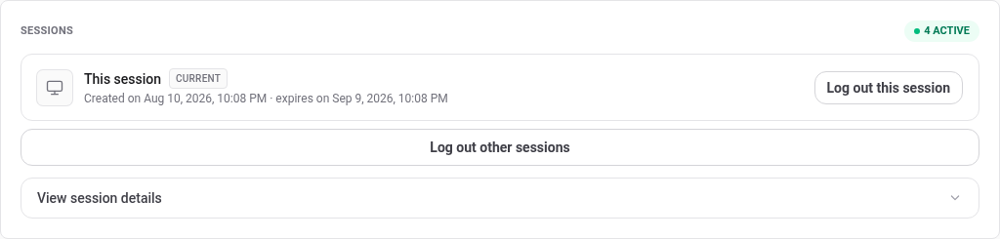

# Your account and settings

**Settings** is the screen you reach from the avatar in the top right. It
holds everything about your account rather than about your money.

## What is on it

| Section            | What it is for                                           |
| ------------------ | -------------------------------------------------------- |
| Account            | Your email and your role                                 |
| Security status    | Whether the local AI is on, and when you last signed in  |
| Language           | The interface language                                   |
| Security           | Changing your password                                   |
| Two-factor         | [A second check at sign-in](./two-factor.md)             |
| Sessions           | Every device signed in as you                            |
| Tags               | Renaming, recolouring and deleting [tags](./tags.md)     |
| AI insights        | The optional [local AI advice](../ai-insights.md)        |
| Backup and restore | [Exporting and restoring your data](./backup-restore.md) |
| Delete my account  | Removing the account and its data                        |

Your email cannot be changed from here, and your role is shown rather than
chosen: only an administrator changes who is one.

## Change your language

The choice takes effect at once and is remembered for about **400 days**.

Two things about it are worth knowing, because both surprise people:

- **It is stored in the browser, not on your account.** Signing in from a
  second device starts that device on whatever language it negotiates from
  the browser, not on the one you picked here.
- **It overrides your browser's language from then on.** Once you have
  chosen, changing your browser's preferred language no longer moves the
  app; come back here instead.

## Change your password

**Change password** asks for the current one, then the new one twice. A new
password must be at least **12 characters**.

Saving it **signs every other session out** and keeps the one you are using.
That is the point rather than a side effect: if you are changing your
password because you think somebody else has it, the change is what removes
their access.

## See where you are signed in

Each sign-in creates a session that lasts **30 days**. The list shows how
many are active, marks the one you are using, and expands to show the rest.

- **Log out this session** signs you out here.
- **Log out other sessions** signs out everywhere else and leaves you
  signed in.

A phone you no longer own, or a browser on a shared machine, is a session
here until it expires. That button is how you end it.

## Delete your account

At the bottom, and irreversible. It removes your account and everything in
it: transactions, categories, budgets, rules, net worth history, goals,
tags.

**To confirm, you must type `SUPPRIMER`**, in capitals, exactly as shown.
It is the French word for "delete", and it is the same word whatever
language the interface is in.

Only your own account goes. Other accounts on the same instance are
untouched, and so is the instance itself.

If what you want is a copy of your data before it goes, take one first:
[exporting and restoring your data](./backup-restore.md).

---

For the exact password rules, the session lifetime, and what each control
touches, see the [account reference](../reference/account.md).
