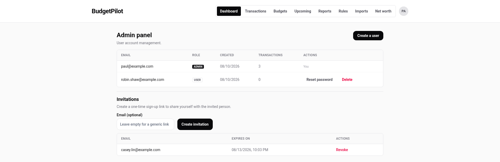
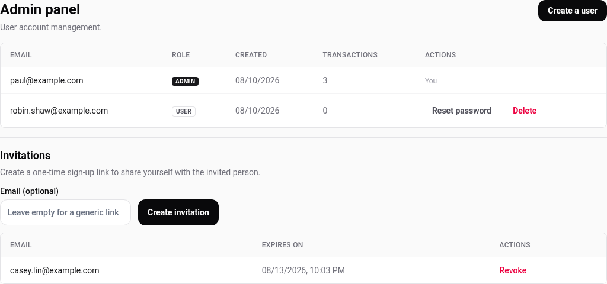

# The admin panel

Only an administrator sees it, and only administrators can reach `/admin`.
It manages the people on the instance, not the money in it.

The first account created on an instance becomes the administrator. Who may
create an account at all is an install setting, not something on this page:
see [configuration](../configuration.md#who-can-create-an-account).

## The user table

One row per account, oldest first, twenty to a page. Each shows the email,
the role, the date the account was created, and how many transactions it
holds.

Your own row carries **You** where the actions would be. You cannot delete
or reset yourself from here, which is what stops an instance losing its last
administrator by accident.

| Action         | What it does                                                   |
| -------------- | -------------------------------------------------------------- |
| Reset password | Issues a temporary password and signs that user out everywhere |
| Delete         | Removes the account and everything in it                       |

**Reset password** shows the temporary password once, on screen, for you to
pass to the person yourself. Nothing is emailed; the instance sends no mail
at all. They are asked to choose a new one when they next sign in.

It does **not** get somebody past two-factor authentication. If that is what
they are stuck on, read
[what happens when you lose access](./two-factor.md#if-you-lose-access):
there is no button for it.

**Delete** is irreversible and takes the account's transactions, categories,
budgets, rules, net worth history, goals and tags with it.

## Invitations

An invitation is a **single-use sign-up link** you create here and pass to
the person yourself.

1. Optionally type the address the invitation is for. Leaving it empty makes
   a **generic link** anyone holding it can use, once.
2. Press **Create invitation**.
3. **Copy the link now.** It is shown once and cannot be shown again after
   you leave the page.
4. Send it however you like. Nothing is emailed.

If you named an address, the link only works for that address: signing up
with a different one is refused.

Pending invitations are listed with the date they expire, and **Revoke**
ends one early. An invitation expires by itself after **72 hours** by
default.

## Creating an account directly

**Create a user** takes you to the ordinary sign-up form. Because you are
already signed in as an administrator, it does not ask for the bootstrap
token, so you can create an account by typing its email and password
yourself instead of sending a link.

Use an invitation when the person should choose their own password. Use this
when they should not, or cannot.

---

For registration modes, the bootstrap token, and the settings behind all of
this, see [configuration](../configuration.md#who-can-create-an-account).
