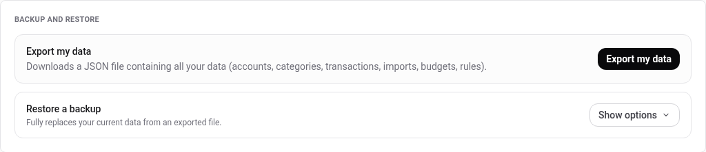
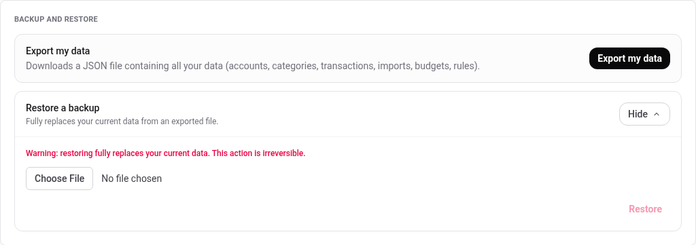

# Exporting and restoring your data

A button in **Settings** downloads everything in your account as one file,
and another button puts it back.

This is the user-facing half. Backing up the whole instance is a different
job: every account, the database file, and the secrets. It belongs to whoever
runs the server: see [running it day to day](../operations.md#backups).

## Export

**Export my data** downloads a `.json` file named for the day you took it,
`budgetpilot-backup-2026-08-10.json`.

It holds your accounts, categories, transactions, imports, budgets, rules,
category natures, net worth accounts and their history, savings goals, bank
connections, tags and splits. In other words, everything you can see in the
app.

It does **not** hold your password, your two-factor secret, your recovery
codes, or your sessions. Verified on a real export: none of those appear in
the file. So the export cannot be used to sign in as you, and restoring it
somewhere else does not carry your password with it.

Each amount in the file also records which currency it is in. You will see
`EUR` everywhere today, because that is the only currency the app uses so far.
It is written down anyway so that a file exported now still means the same
thing years from now, whatever the app supports by then.

**An older backup still restores.** A file you exported before this was added
has no currency written in it, so restoring it reads every amount as euros,
which is what it was. Nothing to do on your side.

Nothing is sent anywhere. The file is produced by your own instance and
downloaded straight to your machine.

## Restore

**Restore a backup** is behind a disclosure, and the first thing it shows is
what it is going to do:

**It replaces, it does not merge.** Everything currently in your account is
deleted and rebuilt from the file. A transaction you entered after taking
the backup is gone. There is no undo, and confirming asks you a second time
before it happens.

That makes it the right tool for two things and the wrong tool for a third:

| Want to                                   | Use restore? |
| ----------------------------------------- | ------------ |
| Move your data to a fresh instance        | yes          |
| Roll your account back to a known state   | yes          |
| Merge two accounts, or add a few old rows | **no**       |

Only your own account is touched. Other accounts on the same instance are
not affected, and neither is your password or your two-factor setup.

## Only restore a file you exported yourself

A backup is **input the app trusts**. It is checked for shape: the format
version, the required sections, the field types, and that the parts of a
split add up to their parent. It is not otherwise treated as hostile, and it
becomes your data wholesale.

Concretely, a file that someone else edited can put figures in your account
that no screen in the app would ever have produced. The sum check exists
because a hand-edited file could once carry a split part whose sign opposed
its parent, inventing money in every per-category total from then on.

So the rule is short: **restore files you produced from your own instance.**
Treat a backup someone sends you the way you would treat a spreadsheet macro
from a stranger.

## What is refused

| The file                           | What you get                        |
| ---------------------------------- | ----------------------------------- |
| Damaged, or not JSON at all        | _The file is not valid JSON._       |
| From a newer format version        | _Unsupported backup format._        |
| Missing a section, or a bad field  | _Invalid or corrupted backup file._ |
| Holding two categories of one name | _...contains a duplicate category._ |
| Holding an invalid currency code   | _Invalid or corrupted backup file._ |
| Larger than 20 MB                  | _...file is too large..._           |
| Holding over 2 million entries     | _...too many separate entries..._   |
| Nothing chosen                     | _No file selected._                 |

The first two look similar and mean opposite things. _Not valid JSON_ means the
file is damaged, so export a fresh one. _Unsupported backup format_ means the
file is fine but was written by a version this one cannot read, so the question
is which version wrote it.

A refusal changes nothing. Your data is only touched once the file has
passed every check.

---

For what each section of the file contains, what the validator checks and
what it does not, see the
[backup reference](../reference/backup-restore.md). For backing up the whole
instance rather than one account, see
[running it day to day](../operations.md#backups).
