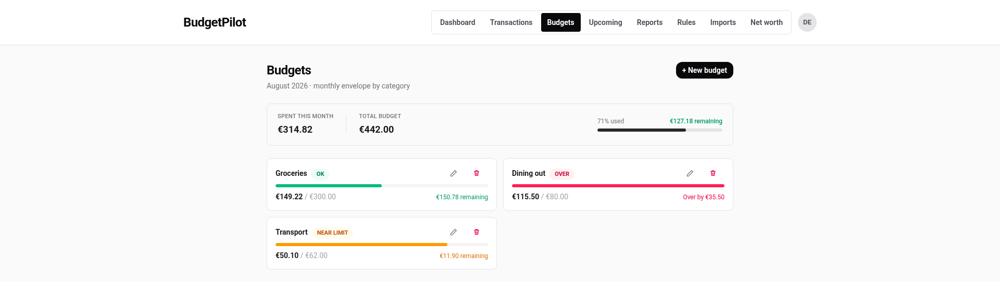
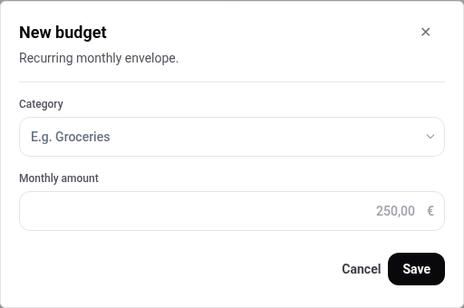
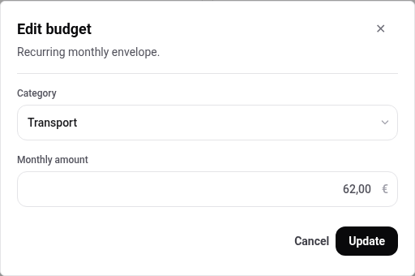
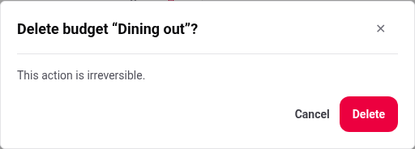
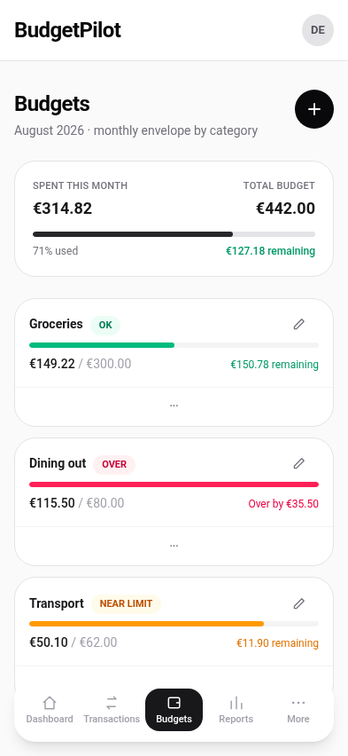

# Budgets

A budget is a monthly limit on one category. Set one, and the app tells you
where you stand against it, every month, without you entering anything again.

## Set a budget

1. Go to **Budgets** and press **+ New budget**.
2. Pick a **Category**.
3. Type a **Monthly amount**.
4. Press **Save**.

The dialog calls it a _recurring monthly envelope_, and that is exactly what
it is: one amount that applies to every month, not a figure you re-enter in
September. The page always shows the current month, named under the title.

Either decimal separator works. `60.00` and `60,00` are both accepted and
both store sixty euros, whichever language you read the app in.

## Read the three states

Each card carries a badge:

| Badge          | Meaning                               |
| -------------- | ------------------------------------- |
| **OK**         | Under 80% of the limit                |
| **Near limit** | 80% or more of the limit, still under |
| **Over**       | Past the limit                        |

Under the badge, the card shows spent against limit and what that leaves.
Once you are over, the last figure becomes how far over you are.

The strip at the top adds up **only the categories you have budgeted**. It
is not your total spending for the month, and it is not meant to be: it
answers "how am I doing against the limits I set", so a month where you
spend nothing outside your budgets and a month where you spend a great deal
outside them can show the same figure.

## Change or remove one

The pencil on a card opens the same dialog with the current amount filled
in, and **Update** replaces it.

The bin asks before it does anything.

Deleting a budget removes the limit. It never touches a transaction, so
nothing about your spending history changes, and setting the budget again
later picks the same figures back up.

## On a phone

Two differences from a computer, both about where the controls are:

- **+ New budget** becomes a round **+** at the top right.
- The bin is behind the **⋯** at the bottom of each card. Press it and a
  **Delete** button appears on the card, which then asks for confirmation
  the same way.

## Where else budgets show up

- **The dashboard** carries a Budget tracking card with up to six of them,
  and raises an insight when one is over or near its limit. See
  [the dashboard](./dashboard.md).
- **Split transactions** count per part, so splitting an 80.00 € shop
  between Groceries and Shopping charges each budget its own share. See
  [splitting a transaction](./split-transactions.md).

---

For the exact thresholds and what the summary strip counts, see the
[budgets reference](../reference/budgets.md).
