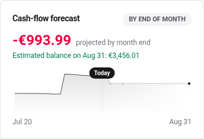
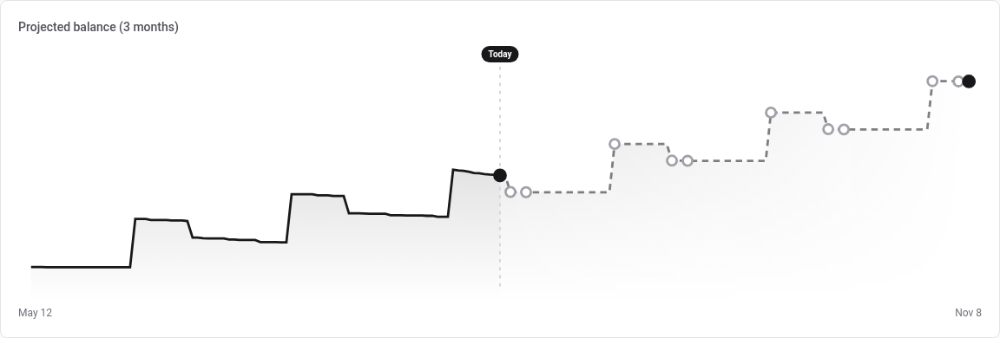
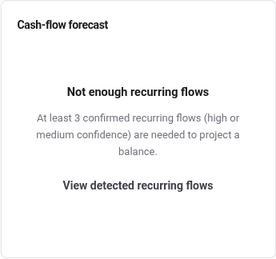
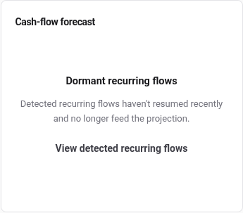

# Cash-flow forecast

A projection of your balance, built only from payments the app has watched
happen more than once. Nothing is sent anywhere and no model is involved:
it is arithmetic on your own history.

## Read the card

Three things, in order:

- **The delta**, what the projection expects to move between now and the end
  of the month. Negative means bills still to pay.
- **The estimated balance** on the last day of the month.
- **The curve**, solid up to today and dotted after it. The marker is today.

## Where the starting balance comes from

The curve starts from the total of your **checking** accounts on the
**Net worth** page. Savings, investment, real estate and debt accounts are
left out on purpose: the question is whether you can cover what is coming,
not what you are worth.

With no checking account recorded, there is nothing to start from. The
curve then shows the **net movement** from zero rather than a real balance,
which is still useful for the shape and useless for the level. Recording one
account fixes it.

## The three-month version

`/reports` carries the same projection over **three months** instead of to
the end of the current month.

Underneath it, **Detected flows** lists exactly what the projection is built
from. That table is the place to look when a projection surprises you. See
[reports](./reports.md).

## What feeds it

A payment has to earn its way in:

- **at least three occurrences**, so a rhythm can be seen at all;
- **high or medium confidence**, meaning the rhythm and the amount are
  steady enough to extrapolate;
- and it has to be **recent**: a flow that has stopped happening stops
  being projected.

Everything else is ignored. A one-off purchase never enters the projection,
which is why the forecast does not react to a large one-off expense.

## When it says nothing

Two states replace the curve, and they mean different things.

**Not enough recurring flows**: fewer than three confirmed flows exist. A
new account is here, and so is an account whose spending is genuinely
irregular.

**Dormant recurring flows**: flows were detected, and none of them has
recurred recently enough to be trusted. This is what an old database looks
like: the rent and the subscriptions are still in the history, but the
history stopped.

The first is answered by importing more history, the second by importing
more **recent** history.

Both states offer a link to the detected flows on `/reports`. When nothing
has been detected at all there is nothing to see there yet, so the link is
worth following in the dormant case and not in the other one.

## What it is not

Not a budget, and not a warning system. It says what would happen if your
recent past repeated, which is the most honest projection available without
asking you to declare anything.

---

For the exact gates and how the three windows relate, see the
[forecast reference](../reference/cash-flow-forecast.md).
