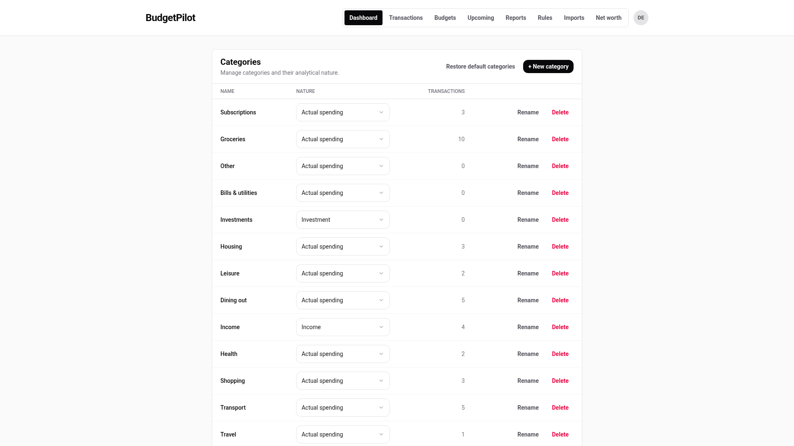
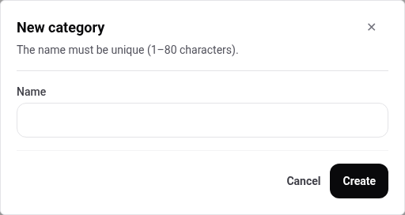
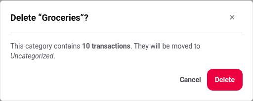
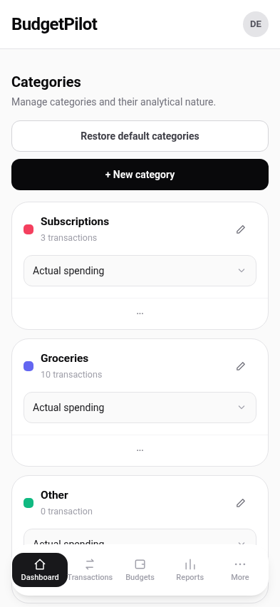

# Categories

A category answers "what kind of spending is this". Every transaction has
exactly one, and this page is where the list is managed.

## Getting there

**Categories is not in the navigation bar.** It is reached from a
transaction: open one on the **Transactions** screen and follow **Manage
categories** beside the category field. That is the only route, on both a
computer and a phone.

## What you start with

A new account has **fourteen** categories, ready to use. The
**Transactions** column tells you which are earning their place, and a
category you never use costs nothing.

## Create one

**+ New category** asks for a name and nothing else. The dialog states the
limit: **1 to 80 characters**, and the name must be unique.

Nature is set afterwards, from the list.

## Rename one

**Rename** changes the name everywhere it appears at once. Nothing is
detached and nothing is recategorised: a renamed category is still the same
category, so its transactions, its budget and any split parts pointing at it
follow the new name.

## Set the nature

The **Nature** column is a list on every row, and it is what the dashboard's
Real analysis and the reports' spending-by-nature chart are built from.

Eight values are available:

| Value               | Use it for                                  |
| ------------------- | ------------------------------------------- |
| **None**            | No opinion. Falls back to the amount's sign |
| **Income**          | Money coming in                             |
| **Actual spending** | Money genuinely leaving your budget         |
| **Transfer**        | Movement between your own accounts          |
| **Investment**      | Money you still own, in another form        |
| **Refund**          | Money coming back                           |
| **Fees**            | Bank and service charges                    |
| **Unclassified**    | Deliberately set aside                      |

The distinction that matters is **Transfer** and **Investment**: money moved
to a savings account is not spending, and until its category says so it is
counted as though it were. That is the difference between "I spent €2,000
this month" and "I spent €700 and saved €1,300".

## Delete one

Delete tells you what it is about to do before it does it.

Transactions are never deleted with the category. They are moved to
**Uncategorized**, and the dialog says how many.

One case is refused rather than confirmed: a category still used by the
parts of a **split transaction** cannot be deleted, because that money would
have nowhere to go. See
[splitting a transaction](./split-transactions.md).

## Start over

**Restore default categories** puts the original fourteen back. Categories
you added are left alone.

## On a phone

---

For the naming rules and how nature maps to what the dashboard shows, see
the [categories reference](../reference/categories.md).
