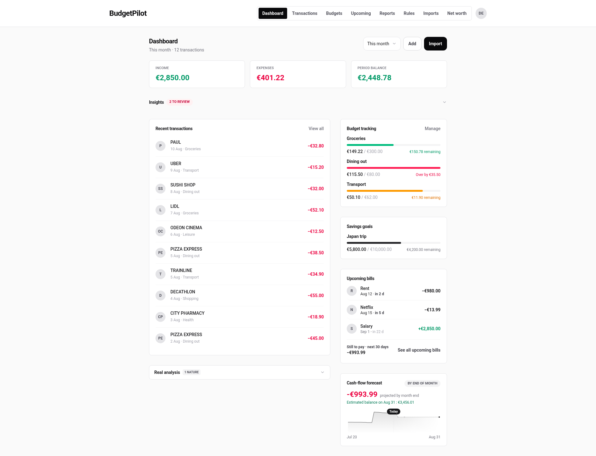
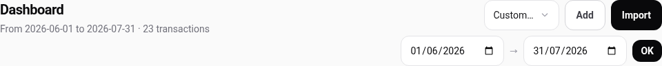
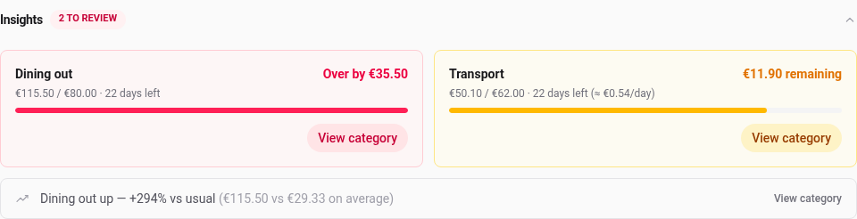
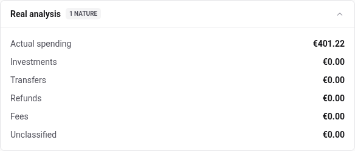
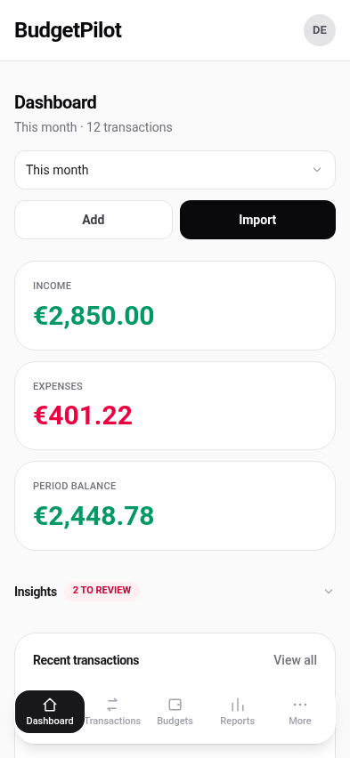

# The dashboard

The first screen after signing in. It answers three questions about one
period of time: what came in, what went out, and what is still coming.

Everything on it is scoped to the period named in the selector at the top
right, except the two cards about the future. Those are explained at the
bottom of this page, and the distinction matters more than it sounds.

## Change the period

The selector offers six choices:

| Choice       | What it covers                           |
| ------------ | ---------------------------------------- |
| This month   | The 1st of the current month until today |
| Last month   | The whole of the previous calendar month |
| Last 30 days | A rolling window ending today            |
| Last 90 days | A rolling window ending today            |
| All time     | Every transaction you have               |
| Custom…      | Two dates you pick                       |

Choosing **Custom…** reveals two date fields and an **OK** button. Fill in
both, press OK, and the line under the title states the range you chose.

The chosen period is in the address bar, so a period you look at often can
be bookmarked. A custom range looks like
`/?period=custom&from=2026-06-01&to=2026-07-31`.

The two date fields are your browser's own, not the app's, so they are laid
out in your browser's language rather than the one you set in BudgetPilot.
An English app in a French browser really does show `31/07/2026`.

## Read the three figures

**Income** and **Expenses** are the money in and the money out over the
period. **Period balance** is the difference: income minus expenses, green
when you took in more than you spent.

The line under the title says how many transactions those figures cover, so
a number that looks wrong can be checked against a count before you go
looking for a bug.

A split transaction counts as its parts, not as one payment, so an 80.00 €
supermarket trip split between Groceries and Shopping adds 80.00 € to
Expenses and contributes to two different categories. See
[splitting a transaction](./split-transactions.md).

## Act on an insight

**Insights** collapses and expands. Open it to see what the app thinks is
worth your attention right now.

Two kinds of thing appear here:

- **A budget alert**, when a category is over its limit or heading that way.
  It states how much is left and how many days remain in the month. A
  category that is close but not over also gets the daily pace that would
  keep it under, and links straight to that category's transactions.
- **Unusual spending**, when one category is much higher than it usually is.
  The comparison figure is beside it, so you can judge whether it is a real
  change or one large purchase.

The badge counts **budget alerts only**. Above a panel holding three items
it reads `2 to review`, and that is not a miscount: two of them are budget
alerts and the third, the unusual-spending line, is not.

**View category** on either one opens the transactions list already filtered
to that category, which is where you can actually do something about it.

## See where the money really went

**Real analysis** splits the period by _nature_ rather than by category.

This is the answer to "I did not spend that much this month". Moving money
to a savings account is not spending, and neither is a refund landing back
in your account, but both move through your transactions. The badge counts
how many of the six lines are not zero.

Nature comes from the categories you have mapped, so a transfer only counts
as one if its category is mapped to Transfer. Categories are managed on the
**Categories** page.

## Check what is still coming

Two cards at the bottom right look ahead instead of back, and they do not
follow the period selector.

**Upcoming bills** lists what is due next, from the recurring payments the
app has detected in your own history. The total underneath is for the
**next 30 days**, counted from today.

**Cash-flow forecast** projects a balance to the **end of the current
month**, and shows the curve getting there.

Those two windows are different on purpose, and the labels say which is
which. On the last day of a month they are as different as they get: the
forecast has almost nothing left to project while the 30-day total still
holds a month of bills. If the two totals disagree, that is why.

## On a phone

The same cards, stacked, with the navigation at the bottom of the screen.

**Recent transactions** is shorter here: five rows rather than the ten a
computer shows. Nothing is missing, and **View all** opens the full list.

## Add or import from here

**Add** opens a form for a single transaction without leaving the page.
**Import** goes to the import screen for a bank file. Both are in the header,
next to the period selector.

---

For the exact definition of every figure and the limits on each card, see
the [dashboard reference](../reference/dashboard.md).
