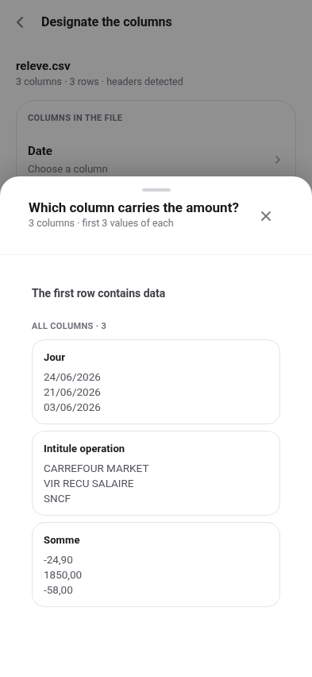
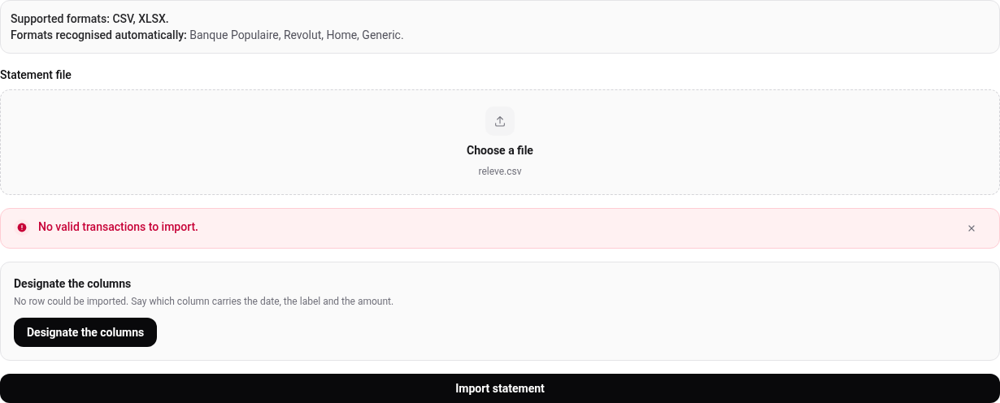
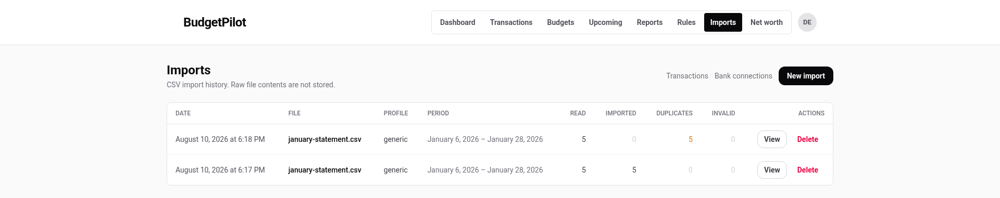
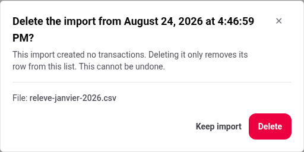
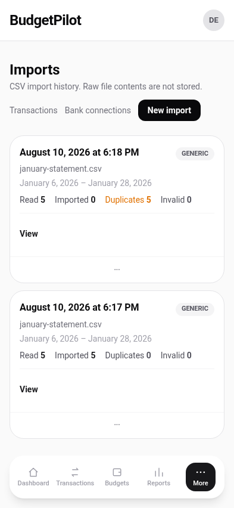

# Importing a statement, and the import history

Every import is recorded, with what it did, and can be undone in one action.

## Import a file

**Imports > New import** takes a **CSV** or **XLSX** statement.

There are three ways a file gets read, and you only ever meet the first one
unless it fails.

### 1. It is recognised, and there is nothing to choose

BudgetPilot reads the file's header row and works out the format itself. It
recognises **Banque Populaire**, **Revolut**, **Home** (its own export) and a
**Generic** shape covering any file whose date, label and amount columns are
named something it already knows.

The column layouts each one expects are in
[getting started](../getting-started.md#first-steps-in-the-app), and what
Generic and Revolut accept, and still refuse, is in
[the imports reference](../reference/imports.md).

A file BudgetPilot recognises goes straight into the account that format always
uses, so there is nothing to answer here either.

One exception: if you have **two accounts using the same format**, a recognised
file cannot always say which one it is from.

If your bank prints the account number in the statement and one of your accounts
carries that number, the import goes there and you are not asked. Otherwise the
import stops and the summary shows an **Account** row: pick the account this
statement belongs to and press **Import the statement** again. Nothing is written
until you do, and picking the wrong one is undone by deleting the import from the
history.

The row only lists accounts you already have. To send a statement to an account
that does not exist yet, create it in **Settings > Accounts** first.

If the file turns out to cover **several accounts** rather than one, the import
still goes through and the summary tells you which account the rows landed in.
Splitting one statement across several accounts is not something BudgetPilot can
do yet.

### 2. It is not recognised, so you are asked which column is which

Banks name their columns however they like, and no list covers all of them. When
none of the four shapes fits, the import is not refused: the summary says the
columns were not recognised and offers **Designate the columns**.

That screen asks two things: which of your accounts this statement is from, and
which column is which.

| Row          | What it wants                             |
| ------------ | ----------------------------------------- |
| **Account**  | the account this statement is from        |
| **Date**     | the column holding the transaction's date |
| **Label**    | what the transaction says it was          |
| **Amount**   | the sum, with its sign                    |
| **Category** | optional, if your bank provides one       |

The **Account** row is at the top and is usually already filled in. See [which
account is this statement from?](#which-account-is-this-statement-from) below.
The rest of this section is about the four column rows.

Tap a row and you get your own file, one card per column, each showing the
column's name and its **first three real values**. You are choosing from the
data in front of you rather than from a list of names.

**Columns you do not designate are ignored**, and that is the normal outcome. A
fifteen-column statement usually needs three of them; the screen says how many
it will ignore before you import.

Three columns are enough. **Category is optional**, and leaving it empty means
the transactions arrive uncategorised, where [categorization
rules](./rules.md) can still pick them up.

#### On a wide screen

The same four rows sit on the left, and your file is drawn beside them: the
first rows of the statement, columns in the order the file writes them, with
the role you assigned printed above each column's own name. Columns you have
not designated are greyed, not hidden, so you can still see what's in them.

A wide statement scrolls sideways and says how much of it you're seeing, for
example `5 of 13 columns visible`.

The rows you see are your file's actual rows. The values inside the column
cards are picked to be _distinguishing_, so a mostly-empty column shows you its
own few values rather than three blanks. They therefore do not line up into rows. The
preview reads the file again instead of arranging those.

### 3. It is remembered, so you are only asked once

Once you have designated a file's columns, BudgetPilot remembers the answer
against that file's **column names**, not its name or its date. The next
statement from the same bank imports straight through without asking.

Because it is keyed on the column names, a bank that adds a column, or reorders
them, changes nothing. If a bank **renames** one, that row alone comes back to
be redesignated and the others keep their answers.

Memorisation is on by default, stated on the screen, with a link to decline it
for a file you do not expect to see again.

### Forget a remembered answer

Go to **Settings > Remembered columns**. Each row shows the columns it names,
when it was remembered, and how many imports have used it. **Forget** removes
it.

Forgetting removes the answer, not the history. Your imported transactions stay
exactly where they are. What you lose is the **View the columns** link on those
past imports, so you can no longer reopen them from the Imports page.

You'd forget one when a bank changes its export and the old answer now reads
the wrong columns, or when you've reached the limit on how many BudgetPilot
keeps and want the room for a new bank.

### A statement with no header row

Some exports start straight into transactions, with no titles at the top. On
the designation screen, turn on **The first row contains data**.

Turn it on and BudgetPilot reads every line as a transaction. Leave it off and
it treats your first transaction as a title row and skips it, which is one
transaction missing from every import of that file.

A file like this is designated **every time**. There are no column names to
remember it by, and its first line changes with every statement, so there is
nothing stable for BudgetPilot to recognise it by later.

The **Account** row is on this screen too. With no column names there is nothing
for BudgetPilot to remember the file by, so it asks for the account every time,
along with the columns.

## Which account is this statement from?

Your transactions are grouped by **account**. If you have a current account and
a savings account at the same bank, each one gets its own group.

This matters for one reason. The same shop, the same day, the same amount can
appear on two of your accounts, and both are real. Keeping the accounts apart is
what stops BudgetPilot mistaking one for a copy of the other.

So the designation screen asks. The **Account** row is at the top. Tap it and
pick from your accounts.

Most of the time the row is already filled in and you can leave it alone. Here
is what it can say:

| The row says                                                 | What to do                                    |
| ------------------------------------------------------------ | --------------------------------------------- |
| _IBAN ···4417 read from the file_                            | Nothing. Your bank printed the account number |
| _Remembered, 3 imports since 15 August_                      | Nothing. Files like this went here before     |
| _First statement in this format_                             | Pick an account. It will be remembered        |
| _Two accounts use this format. The file does not say which._ | Pick the right one                            |
| _This file contains several accounts._                       | Pick the one you want these transactions in   |
| _The remembered account no longer exists._                   | Pick another one                              |

Two things worth knowing:

- **What the file says wins.** If your bank prints the account number in the
  statement, BudgetPilot uses that, even if you picked something else last time.
- **BudgetPilot does not guess.** When two answers are possible it asks instead
  of choosing one. A statement filed in the wrong place is hard to spot later.

### Making a new account

Tap **New account** in the list. It is there even if you have no accounts yet,
which is where everyone starts.

You get one field, usually already filled in with your bank's name. Change it to
whatever you will recognise, then tap **Create and select**.

The name is only for you. Nobody else sees it, and you can change it later in
**Settings, Accounts**.

## What is refused

| The file                       | What you get                             |
| ------------------------------ | ---------------------------------------- |
| Not `.csv` or `.xlsx`          | _The file must use the .csv or .xlsx..._ |
| Larger than 256,000 bytes      | _Statement too large..._                 |
| An `.xlsx` unpacking past 8 MB | _This spreadsheet unpacks to..._         |
| Empty                          | _The statement file is empty._           |
| Fewer than three columns       | _This file has 2 columns..._             |

**A missing column is not in that table, on purpose.** If the file carries a
date, a label and an amount under names BudgetPilot does not know, you get
_Required column missing_ against each one it could not find, **and the offer to
designate them yourself**. That is a question, not a refusal, and it is
answered on the screen described above.

A file with fewer than three columns is the one case designating cannot repair:
there is nothing to point the three roles at.

The last one needs a word, because it is the only limit that is not about
the size of the file you picked. An `.xlsx` is a zip archive, so a small
file can hold a very large amount of data once opened, and the app measures
that before opening it rather than after. A statement exported from a
spreadsheet application reaches about 3 MB unpacked at the largest size the
upload limit allows, so the 8 MB ceiling is roughly twice what a real
statement needs. If a genuine export is ever refused by it, that is worth
[reporting](https://github.com/NonoHM/budgetpilot/issues), because the
number was chosen from a measurement and can be corrected by another. An
operator can also raise it, up to a point:
see [`IMPORT_XLSX_MAX_UNCOMPRESSED_MB`](../configuration.md#upload-size).

Splitting a long history into several files, a year at a time, works and
costs nothing: duplicate detection is per transaction, so the overlap
between two files is recognised and imported once.

One case it does not cover, because the recognition depends on the
columns: see [Importing the same file twice](#importing-the-same-file-twice).

## Read the summary

The import reports what it did before you go anywhere.

It opens with how many rows it read, then shows what became of them.

| Figure                 | What it means                                                                                                        |
| ---------------------- | -------------------------------------------------------------------------------------------------------------------- |
| **Rows read**          | Data rows found in the file. The header line is not one, and neither is a bank footer the app recognised and skipped |
| **Imported**           | New transactions created                                                                                             |
| **Duplicates skipped** | Recognised as already present, so not created again                                                                  |
| **Invalid rows**       | Rows refused, one per row. A row is refused for one reason, the first one found                                      |

**A problem with the file itself is not a row.** If a required column is missing
or a header appears twice, nothing was read at all, and the summary says so in
words above the figures rather than counting it. That is why the figures are not
presented as a sum: a file refused this way has rows and none of them were
examined, so there is nothing to subtract.

When the rows were read, imported plus duplicates plus invalid is all of them.

**Total spending** and **total income** cover what was actually imported, so
after an import that skipped everything they are both zero. That is the
quickest way to tell "nothing happened" from "nothing needed to happen".

The summary also names the account the transactions went into, so you can catch
a statement filed in the wrong place straight away.

## Importing the same file twice

Duplicate detection is per transaction, not per file, so importing the
same statement again, or a statement that overlaps one you already have,
creates only the rows that are new.

The two rows above are the same file imported twice. The second read the
same five lines, created nothing, and recorded five duplicates.

### When the columns change, the recognition changes

A transaction is recognised by its **date, label, amount and direction**.
The label is one of the columns you designate, so the same statement read
through a **different label column**, or a different date column, produces
different transactions as far as this check is concerned, and every line
imports again.

That happens on exactly one path: correcting a memorised correspondance,
or designating by hand a file that had already been imported under an
automatic profile. BudgetPilot compares the whole run against your
previous imports before writing anything, and if the period, the number
of transactions and both totals match while no individual line is
recognised, it stops and asks. Answer **Ne pas importer** and nothing is
written.

If two imports already in your history look like the same statement, the
**Imports** page says so at the top of the list.

## The history

**Imports** lists every run, newest first, with its date, file name,
detected profile, **the account it was filed into**, the period the file
covered, and the four counts.

Imports made before accounts existed simply show no account, rather than a blank
one. Most of them are filled in automatically the first time BudgetPilot starts
after the update.

Raw file contents are **not stored**. What is kept is the record of the run,
not your statement.

**View** opens the transactions list filtered to that import, which is how
you check what a run actually brought in.

## Undo an import

**Delete** on a row is an undo for the whole run.

It states how many transactions it is about to remove, and removes exactly
those: transactions you imported in other runs, or entered by hand, are
untouched. Anything you changed on an imported transaction goes with it, so
this is an undo of the import rather than a tidy-up.

## On a phone

---

For the columns and what each count includes, see the
[imports reference](../reference/imports.md).

## What this screen does not do yet

Named with their issues rather than promised, so each reads as a decision:

- **No date format, decimal separator or delimiter control.** The screen reserves room for
  them and does not draw them. BudgetPilot reads dates as day/month and the comma as a
  decimal separator; a file written the other way imports on the wrong date rather than
  refusing, which is the one case designating columns cannot repair.
- **A statement whose amounts are all positive beside a debit/credit column is refused
  before this screen** ([#320](https://github.com/NonoHM/budgetpilot/issues/320)). No role
  carries a sign, so designating the amount column would import every row as income.
