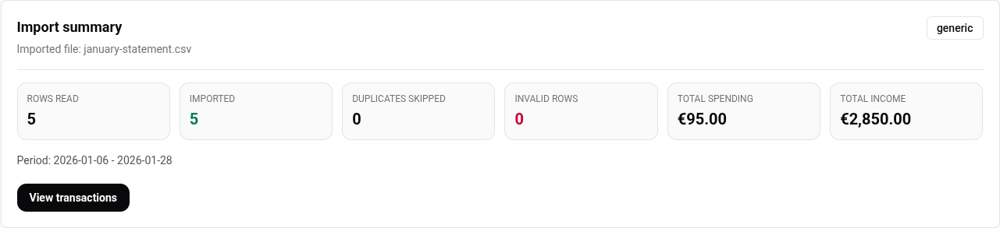

# Importing a statement, and the import history

Every import is recorded, with what it did, and can be undone in one action.

## Import a file

**Imports > New import** takes a **CSV** or **XLSX** statement.

Five profiles are offered — **Auto**, **Banque Populaire**, **Revolut**,
**Home** and **Generic** — and Auto recognises the others from the file's
header row. The column layouts each one expects are in
[getting started](../getting-started.md#first-steps-in-the-app).

**Destination account** is optional, and the form says the one thing about
it that is easy to get wrong: it applies only to the **very first** import
of a given bank profile. Once a technical account exists for that profile,
the choice is ignored.

## Read the summary

The import reports what it did before you go anywhere.

| Figure                 | What it means                                       |
| ---------------------- | --------------------------------------------------- |
| **Rows read**          | Lines found in the file                             |
| **Imported**           | New transactions created                            |
| **Duplicates skipped** | Recognised as already present, so not created again |
| **Invalid rows**       | Refused; the rest of the file still imported        |

The four add up: rows read is imported plus duplicates plus invalid.

**Total spending** and **total income** cover what was actually imported, so
after an import that skipped everything they are both zero. That is the
quickest way to tell "nothing happened" from "nothing needed to happen".

## Importing the same file twice is safe

Duplicate detection is per transaction, not per file, so overlapping
statements do not double your history.

The two rows above are the same file imported twice. The second read the
same five lines, created nothing, and recorded five duplicates.

## The history

**Imports** lists every run, newest first, with its date, file name,
detected profile, the period the file covered, and the four counts.

Raw file contents are **not stored**. What is kept is the record of the run,
not your statement.

**View** opens the transactions list filtered to that import, which is how
you check what a run actually brought in.

## Undo an import

**Delete** on a row is an undo for the whole run.

It states how many transactions it is about to remove, and removes exactly
those: transactions you imported in other runs, or entered by hand, are
untouched. Anything you changed on an imported transaction goes with it, so
this is an undo of the import rather than a tidy-up.

## On a phone

---

For the columns and what each count includes, see the
[imports reference](../reference/imports.md).
