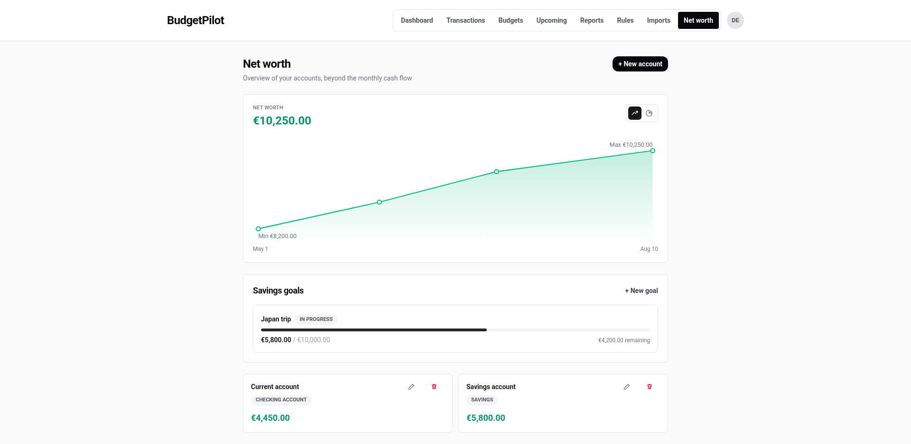
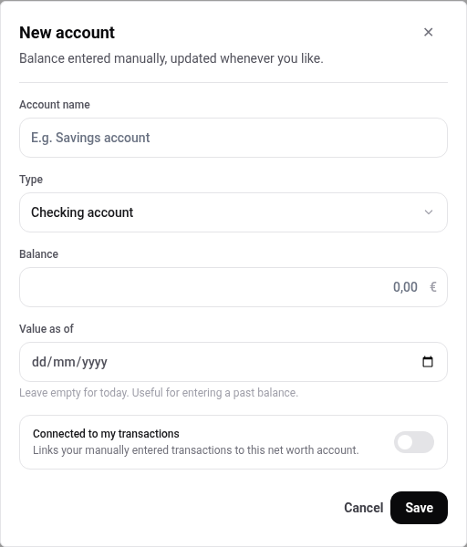
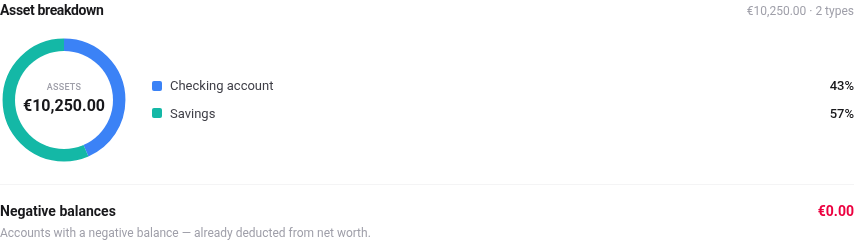
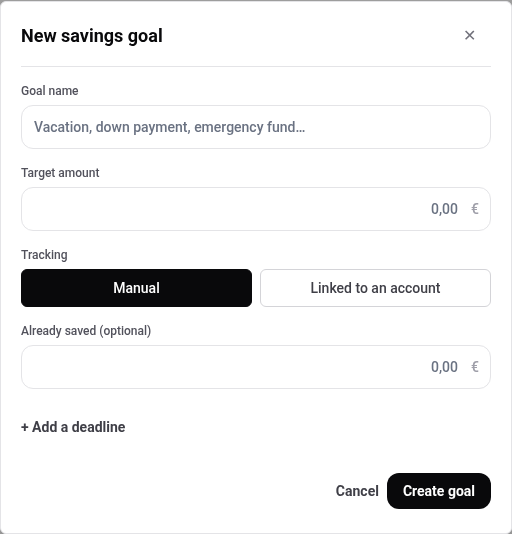
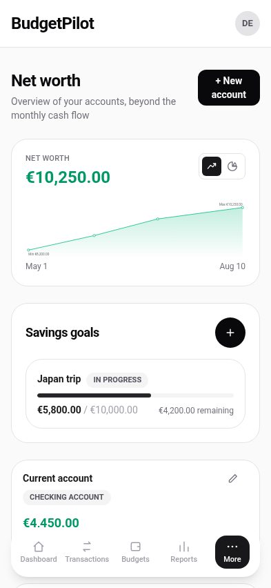

# Net worth

What you own and what you owe, tracked over time. This is the part of the
app that is not about a month: it answers "am I better off than I was", not
"what did I spend".

Balances here are **entered by hand**, not read from your transactions. You
update them when you like, and each update is kept, which is what builds the
curve.

## Add an account

1. Press **+ New account**.
2. Name it, choose a **Type**, and enter the **Balance**.
3. Press **Save**.

Six types are available: **Checking account**, **Savings**, **Investment**,
**Real estate**, **Other** and **Debt**.

Two fields are worth explaining:

- **Value as of** dates the balance. Leave it empty and it means today. Fill
  it in to record a balance from the past, which is how you give the curve
  some history on the first day.
- **Connected to my transactions** links the account to transactions you
  enter by hand.

## Update a balance

Edit the account and change the balance. Each change with a new date is kept
as a point in the history, so the curve is a record of what you entered
rather than a single current figure.

This is also why the **Value as of** field matters: entering three past
balances gives you a curve immediately, instead of waiting three months for
one.

## The two views

The button pair above the chart switches between them.

**Curve view** shows the total over time, with the highest and lowest points
marked.

**Breakdown view** shows what the total is made of, by account type.

The **Negative balances** line underneath is there so a debt is not
double-counted in your head: accounts in the red are **already deducted**
from the net worth figure at the top.

## Savings goals

A goal is a target amount with progress towards it. Press **+ New goal**.

Tracking is either:

- **Manual**, where you type how much you have saved so far, or
- **Linked to an account**, where the balance of a net worth account is the
  progress.

A deadline is optional and added with **+ Add a deadline**.

Up to two goals also appear on the dashboard. See
[the dashboard](./dashboard.md).

## On a phone

---

For the account types, what the curve is built from and how the forecast
uses these balances, see the
[net worth reference](../reference/net-worth.md).
