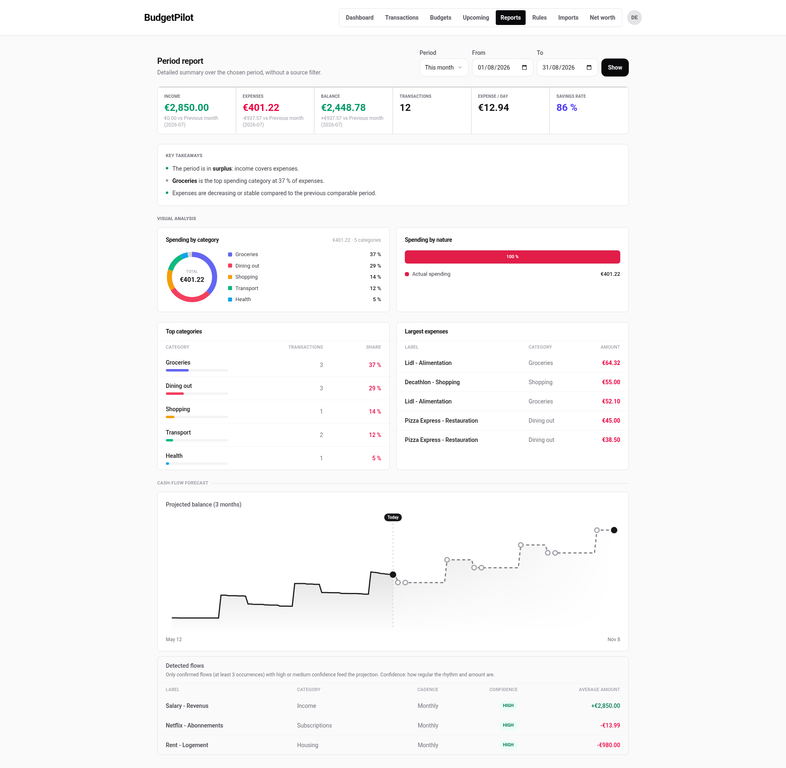
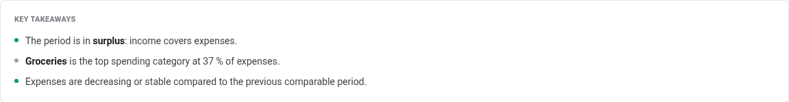
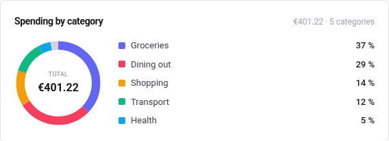
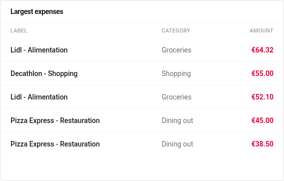
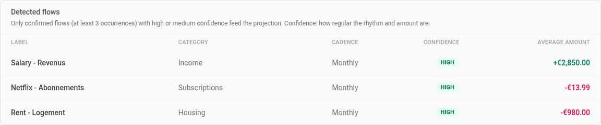
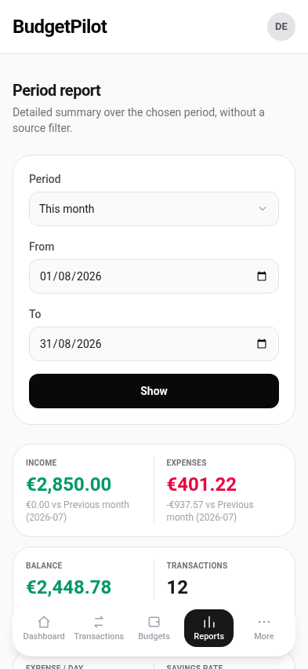

# Reports

One page that answers "where did the money go over this period", with the
comparisons and the charts the dashboard has no room for.

## Choose a period

Three controls sit in the header: a **Period** list, a **From** and a **To**
date, and a **Show** button. Pick a named period, or set the two dates and
press **Show**.

The named periods are the same six the dashboard offers: this month, last
month, the last 30 days, the last 90 days, all time, and a custom range.

## Read the six figures

**Income**, **Expenses** and **Balance** each carry a comparison against the
previous comparable period, named underneath, so a month is never presented
without something to judge it against.

Three more figures have no comparison because they are already relative:

- **Transactions**, how many there were.
- **Expense / day**, the period's spending spread over its days.
- **Savings rate**, the share of income you did not spend.

## Key takeaways

Three sentences under the figures, in plain language: whether the period is
in surplus, which category took the largest share, and whether spending is
rising or not.

They restate what the charts show. If you only read one part of this page,
read this one.

## Visual analysis

**Spending by category** is a donut with the total in the middle and the
share of each category beside it. The header says how many categories the
period covers.

**Spending by nature** answers a different question: how much of that was
really spending, as opposed to a transfer between your own accounts, an
investment or a refund. A period that is 100% actual spending has no
internal movements in it.

## The two tables

**Top categories** repeats the donut as figures, adding how many
transactions each category holds.

**Largest expenses** lists the five biggest single expenses of the period.

In this table the **Label** column appends the transaction's category to the
merchant. For the fourteen categories BudgetPilot creates for you, the name
appended is the stored one, which is French, so a row can read
`Lidl - Alimentation` while the Category column beside it reads `Groceries`.
Both name the same category.

## The three-month projection

At the bottom, the same cash-flow forecast the dashboard carries, over a
**three-month** horizon instead of to the end of the month. The dotted part
is the future; the marker is today.

Under it, **Detected flows** lists what the projection is built from.

The line above the table states the rule: only confirmed flows, meaning at
least three occurrences, with high or medium confidence, feed the
projection. Confidence is how regular the rhythm and the amount are.

This table is the place to check when a projection looks wrong. A payment
you expected that is not listed here is not in the projection either, and
the reason is nearly always that it has not happened three times yet.

## On a phone

The same sections, stacked.

---

For the exact definition of each figure, see the
[reports reference](../reference/reports.md).
