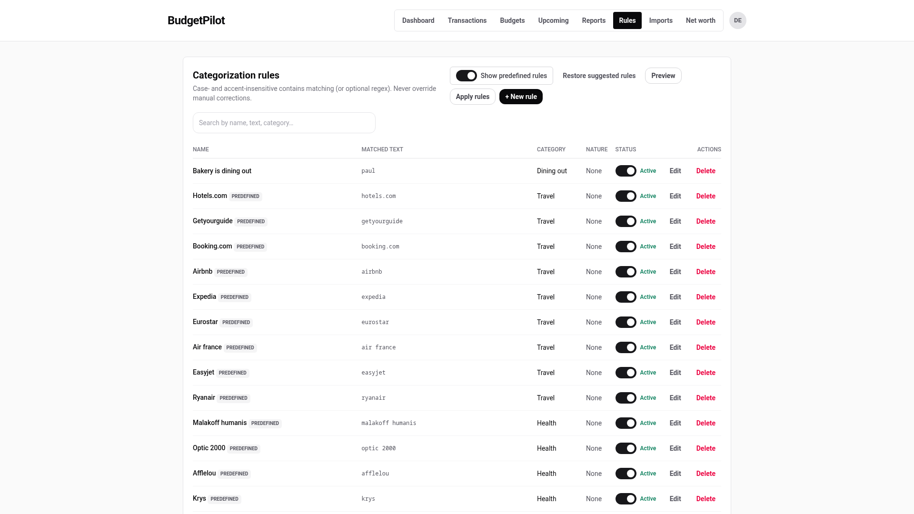
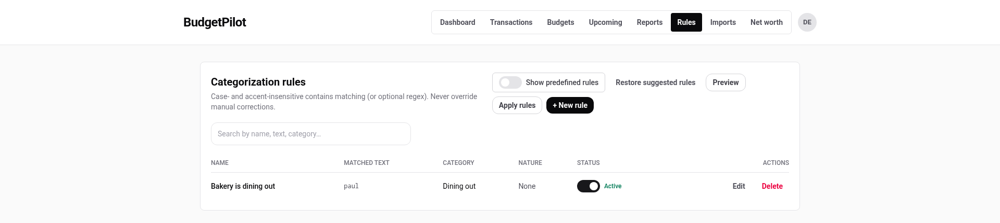
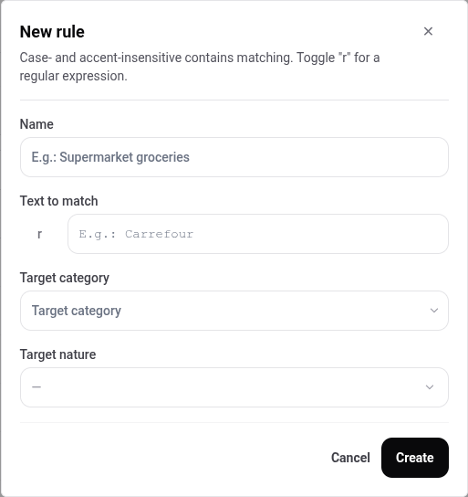
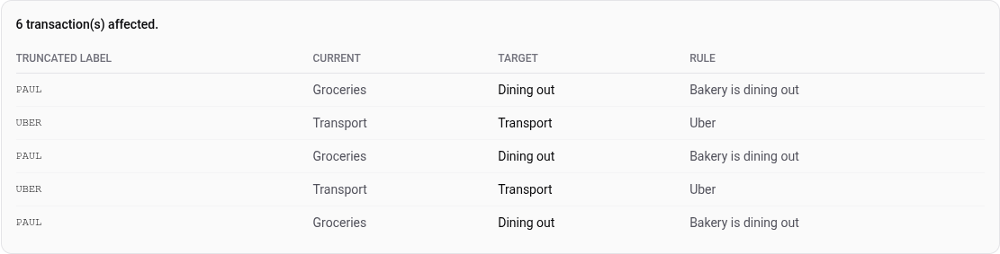
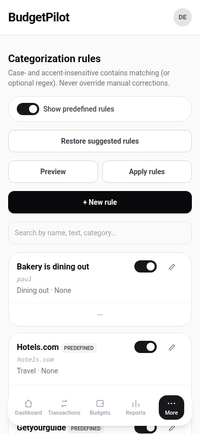

# Categorization rules

A rule says "when a transaction's label contains this text, put it in that
category". Rules run on import, so a bank file arrives already sorted.

## The rule that already exists

BudgetPilot ships **156 rules**, ready to use. They cover the merchants a
French account meets most often, and they are marked **Predefined** in the
list. You do not have to create anything to benefit from them.

Turn the **Show predefined rules** switch off to see only the rules you
wrote yourself. It is on when you arrive, and it does not remember being
turned off.

## Write a rule

1. Press **+ New rule**.
2. Give it a **Name**, for your own benefit. Nothing matches against it.
3. Put the text to look for in **Text to match**.
4. Choose a **Target category**.
5. Optionally choose a **Target nature**.
6. Press **Create**.

Matching **ignores case and accents**, so `carrefour` matches
`CARREFOUR MARKET` and `Crème` matches `CREME`. It is a _contains_ match:
the text has to appear somewhere in the label, not be the whole of it.

The small **r** beside the field turns the text into a regular expression
instead. Eleven of the predefined rules use one, which is how a single rule
covers several spellings of the same thing.

## See what a rule would do before it does it

**Preview** lists the transactions the rules match, with the category each
one has now and the category it would get.

Read the **Current** and **Target** columns together. A row where they are
the same is a rule matching something already in the right place, which
changes nothing. Rows where they differ are the actual work.

**Apply rules** then performs it.

## What a rule will never do

**A rule never overwrites a category you set by hand.** That is the point of
the whole feature: automation for what you have not looked at, and hands off
what you have.

This is worth trusting because it is easy to check. Preview a rule, note how
many transactions it reports, set one of them to a category yourself on the
transactions screen, and preview again. The count goes down by one, and that
transaction is no longer listed.

## Turn one off instead of deleting it

Each rule has an **Active** switch. Turning it off keeps the rule and stops
it running, which is the reversible version of **Delete**.

**Restore suggested rules** brings back the shipped set if you have deleted
some and want them again.

## On a phone

The same controls, stacked, with one card per rule.

---

For what each column means and the exact matching rules, see the
[rules reference](../reference/rules.md).
