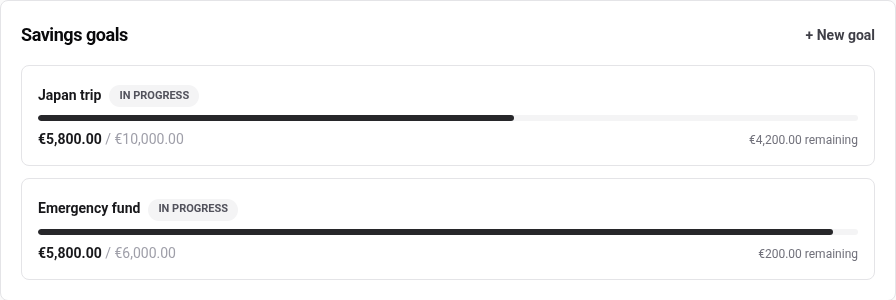
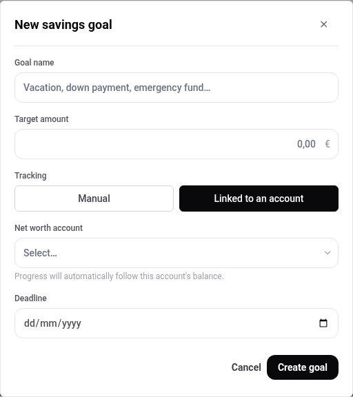
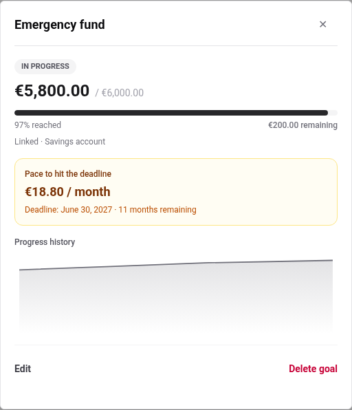
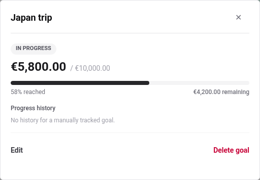

# Savings goals

A goal is an amount you are working towards, and a way to see whether you
are getting there. They live on the **Net worth** page.

## Create one

**+ New goal** asks for a name, a target, and how progress should be
tracked.

## Choose how it is tracked

This is the decision that shapes everything else about the goal.

**Manual** means you type how much you have saved and update it yourself.
Use it when the money is not in an account BudgetPilot knows about: cash, an
account you have not recorded, or several accounts at once.

**Linked to an account** means the goal follows a net worth account's
balance. Use it when one account _is_ the savings pot. You never update the
goal again: updating the account updates the goal.

The difference shows up in the goal's detail, which is what makes it worth
choosing deliberately:

A linked goal has a **progress history**, because the account has one. A
manual goal has a single figure you maintain, so its detail says so plainly
rather than drawing an empty chart.

## Add a deadline

Optional, behind **+ Add a deadline**, and it changes what the goal tells
you. With a deadline the detail shows the **pace** needed to arrive on time:

> Pace to hit the deadline
> **€18.80 / month**
> Deadline: June 30, 2027 · 11 months remaining

That is the number to act on. A target without a date is a wish; a target
with a date is a monthly amount.

## Watch progress

Each card shows the amount saved against the target, what remains, and a
status. Open one for the percentage, the pace if it has a deadline, and the
history if it is linked.

Up to **two** goals also appear on the dashboard, so a goal stays in view
without going looking for it. See [the dashboard](./dashboard.md).

## Change or remove one

**Edit** and **Delete goal** are at the bottom of the detail. Deleting a
goal removes the goal only: no account, balance or transaction is touched,
and a linked goal's account carries on exactly as before.

---

For what each mode tracks and how the pace is derived, see the
[savings goals reference](../reference/savings-goals.md).
