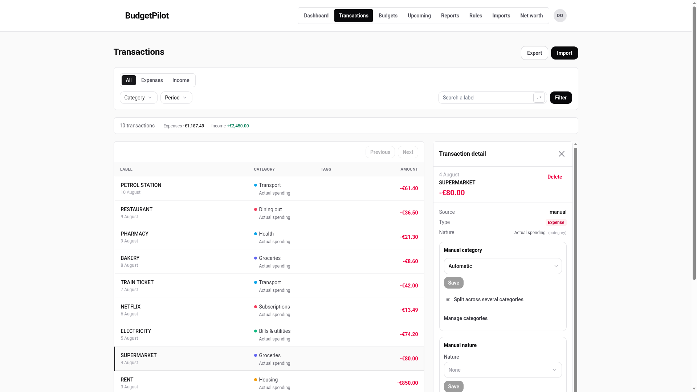
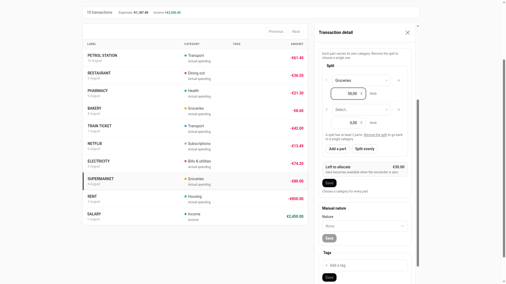
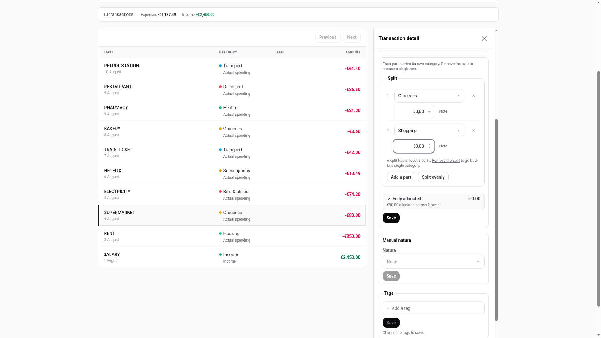
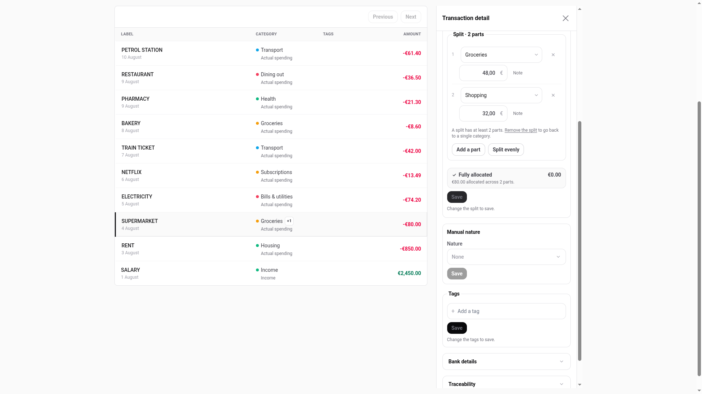
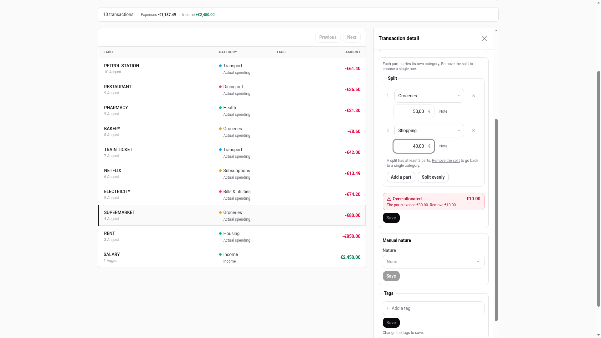
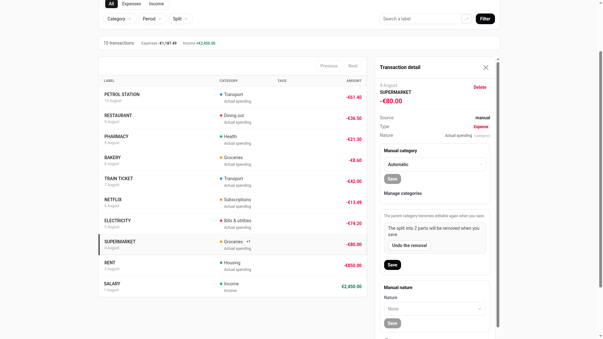
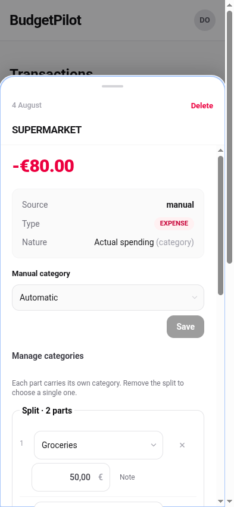

# Splitting a transaction across categories

One payment, several categories. An 80.00 € supermarket trip that was 50.00 €
of groceries and 30.00 € of household goods is one line on your bank statement
and two things in your budget. Splitting it lets both be true.

Nothing else in the app changes shape. The transaction stays one transaction:
one date, one label, one amount, one row in the list. Only the answer to
"which category did this money go to" changes, and it goes from one answer to
several.

Looking for the rules rather than the steps? See the
[split reference](../reference/split-transactions.md). Wondering why a split
row shows two different amounts under a category filter? That is
[explained separately](../explanation/filtered-row-amounts.md).

Labels below are the English ones. If you read the app in French you will see
the French wording in the same places.

## Split a transaction

1. Open **Transactions** and click the transaction. The detail panel opens on
   the right, or as a sheet from the bottom on a phone.
2. Under the category selector, click **Split across several categories**.

3. Two parts appear. Part 1 already carries the transaction's current
   category; part 2 has none yet. Both amounts start at `0,00`.
4. Set a category and an amount for each part.
5. Add more parts with **Add a part** if you need them.
6. **Save**.

> **The amount fields start filled in, not empty.** Each one contains `0,00`
> before you touch it, so typing `50` with the cursor at the start gives you
> `500,00`. Select the whole field before typing, or clear it first.

While the parts do not add up yet, the line above **Save** tells you how far
off you are and Save stays unavailable.

Once they add up exactly, the line turns to **Fully allocated** and Save
becomes available.

A confirmation appears for a few seconds after you save. The lasting signs are
in the panel itself: the section heading becomes **Split · 2 parts** and the
line under Save changes to **Change the split to save**.

The row in the list now shows the category that took the most money, with a
small badge beside it. On a computer you can hover or focus that badge to see
every part.

### Split it evenly

**Split evenly** divides the amount across the parts you have, so you can
adjust from there rather than starting from zero. If it does not divide
cleanly the first parts get the extra cent, and the app marks which part that
is.

You can still edit any amount afterwards.

### Add a note to a part

Each part has an optional **Note**. Use it for things like "Marie's half" or a
receipt reference.

Notes stay in the editor. They are never searched, never filtered on, and they
are not in the CSV export.

## Change a part

Open the transaction again and the parts are there, ready to edit. Change an
amount, change a category, add a part, remove a part with the × beside it.
Save applies all of it at once.

The parts still have to add up to the transaction after your change, so if you
lower one part you have to raise another. The app tells you by how much, but it
will not move the money for you: it cannot know which part you meant to change.

## Remove a split

To go back to a single category, click **Remove the split**.

Nothing happens straight away. The panel says the split will be removed when
you save, and offers **Undo the removal** in case you clicked by accident.
Save actually removes it.

Removing a split loses nothing. The transaction goes back to the category it
had before you split it, which the app kept the whole time. That is why the
category selector is locked while a transaction is split, and why it says so
in place: **Each part carries its own category. Remove the split to choose a
single one.**

## On a phone

Everything above works the same way. The detail panel is a sheet that slides
up from the bottom instead of a column on the right.

## Find your split transactions

Once you have at least one split, a **Split** filter appears in the filter bar
on Transactions, with three choices: All, Split, Not split. It is not there
before that, on purpose: a filter for something you have never used is noise.

Combine it with a category filter to answer questions like "which split
transactions touched Groceries".
