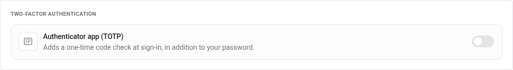
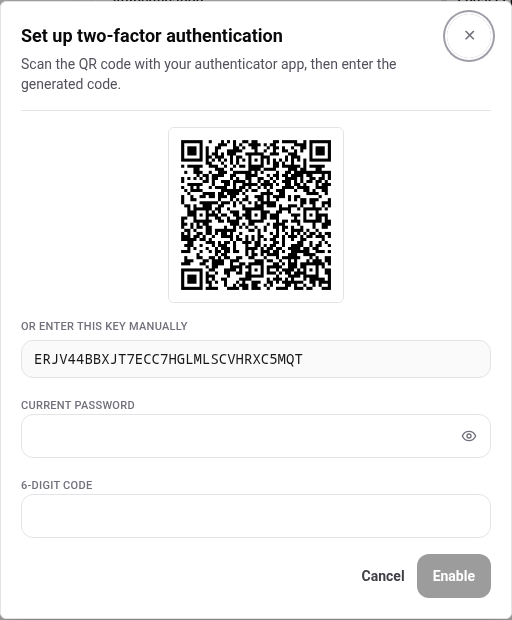
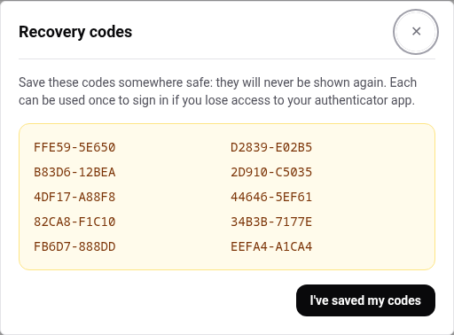
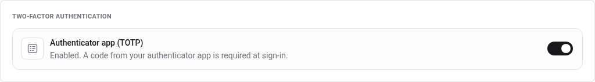
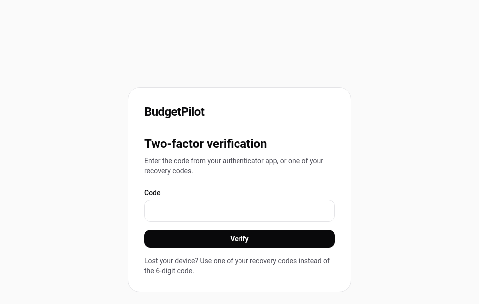

# Two-factor authentication

A second check at sign-in: your password, then a six-digit code from an
authenticator app on your phone. Someone who learns your password still
cannot sign in.

**Read [what happens if you lose access](#if-you-lose-access) before you turn
it on.** On a self-hosted instance there is no support desk, and the
consequences are different from those on a hosted service.

## Turn it on

Everything lives in **Settings**, under _Two-factor authentication_.

Flip the switch and a dialog opens with everything you need:

1. **Scan the QR code** with your authenticator app. Any TOTP app works;
   nothing is sent anywhere, the QR code is generated by your own instance.
2. If your app cannot scan, **type the key** shown underneath instead.
3. Enter **your current password**. Enabling a second factor is as sensitive
   as removing one, so an already-open session is not enough on its own.
4. Enter the **six-digit code** your app now shows, and press **Enable**.

Nothing is saved until that code is accepted. A mis-scanned QR code cannot
leave you with a second factor you have no app for.

## Save your recovery codes

The moment it is enabled, you get ten of them, once:

Each code works **once**, in place of the six-digit one. They are the only
way back into your account if your phone is lost, broken, wiped or replaced.

**They are shown on this screen and never again.** The app stores only a
hash of each, so nobody, including you and including whoever runs the
server, can read them back afterwards. Copy them somewhere that is not the
phone holding the authenticator app: a password manager, a printed sheet,
another device.

**There is no way to generate a new set** without turning two-factor off and
on again, and turning it off needs a working code. So a set of ten is what
you have for as long as two-factor stays on.

Once enabled, the card in Settings says so:

## Sign in from then on

The password page is unchanged. After it, a second page asks for the code:

Type the six digits from your app, or one of your recovery codes, which are
in the form `A1B2C-3D4E5`. Either is accepted in the same field.

A code is valid for its own thirty-second window and the one either side of
it, so a phone whose clock is slightly off still works. If codes are refused
one after another, check the clock on the phone rather than the app.

## Turn it off

Same switch, and it asks for **your password and a current code**. Turning
it off deletes the stored secret and every remaining recovery code, so
turning it on again later gives you a fresh set of ten.

## If you lose access

This is the part to read before enabling, not after.

**With a recovery code**, sign in as usual and put the code in the same
field. That code is then spent; you have one fewer.

**With no phone and no recovery codes left, you cannot sign in, and no
button anywhere in BudgetPilot will change that.** In particular:

- An **administrator resetting your password does not help**. The reset
  issues a new password and signs your other sessions out, and the second
  step still appears. Verified on a running instance: signing in with the
  temporary password lands on the verification page exactly as before.
- There is **no "disable two-factor for this user"** action in the admin
  panel.

The only way back is on the server, in the database, by whoever runs the
instance. If that is you, [operations](../operations.md) is where the
database lives; the two columns to clear are `totpEnabled` and
`totpSecretEncrypted` on your row in the `User` table. If the instance is
run by someone else, they can do it and you cannot.

That is the whole trade: two-factor buys real protection, and on a
self-hosted instance the fallback is a person with database access rather
than a support form. Save the ten codes.

---

For the exact figures, what each step verifies, and what happens when the
codes run out, see the
[two-factor reference](../reference/two-factor.md).
