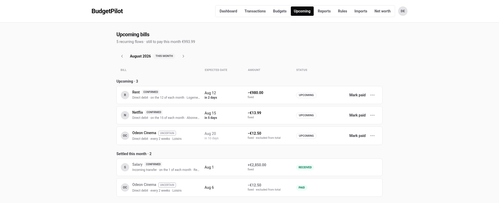
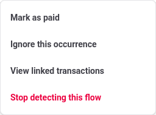
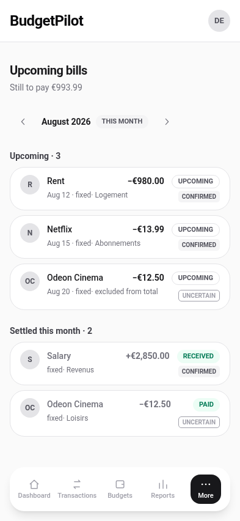

# Upcoming bills

What is due, month by month, worked out from what has already happened. You
declare nothing here: the list is built from repeating payments the app finds
in your own transactions.

## Read a row

Each row is one expected payment:

- **The name and a confidence badge.** `Confirmed` means the rhythm and the
  amount are steady. `Uncertain` means they are not, yet.
- **The rhythm, in words**: "Direct debit · on the 12 of each month", or
  "every 2 weeks", with the category it lands in.
- **The expected date**, and how far off it is.
- **The amount**, marked `fixed` when it has not been varying.
- **The status**: `Upcoming`, or `Paid` and `Received` once settled.

The page splits into **Upcoming** and **Settled this month**, each with its
own count, so what is still ahead of you is never mixed with what is done.

## The total in the header

The line under the title gives the number of flows and **what is still to
pay this calendar month**.

`Uncertain` flows are **excluded from that total**, and each such row says so
under its amount. The reasoning is that a total you cannot rely on is worse
than a smaller one you can, so the app only counts what it is sure about,
and still shows you the rest.

This is a **calendar month** figure. The dashboard's Upcoming bills card
shows a **rolling 30 days**, and the cash-flow forecast runs to the end of
the month. Three windows, three questions. When two of them agree it is
because the bills happen to fall inside both.

## Other months

The arrows either side of the month name move back and forth, and the
address bar carries the month, so a particular month can be bookmarked. A
badge marks the current one.

## Correct what the app got wrong

The **⋯** on each row opens four actions.

| Action                       | Use it when                                          |
| ---------------------------- | ---------------------------------------------------- |
| **Mark as paid**             | It has gone out but not appeared in your account yet |
| **Ignore this occurrence**   | This one month is not happening. The flow stays      |
| **View linked transactions** | You want to see what the app based this on           |
| **Stop detecting this flow** | It is not a bill at all, or it has ended for good    |

**Ignore this occurrence** and **Stop detecting this flow** are the pair to
keep straight: the first is about one month, the second is about the flow
for good.

**View linked transactions** is the one to reach for first when a row looks
wrong. It shows the payments the app grouped together, which is usually
enough to see why it guessed what it guessed.

## Nothing here?

A flow needs **at least three occurrences** before it is confirmed. A
subscription you started last month is not missing, it is not confirmed yet.

## On a phone

---

For what the badges mean exactly and what counts towards the total, see the
[upcoming bills reference](../reference/upcoming-bills.md).
